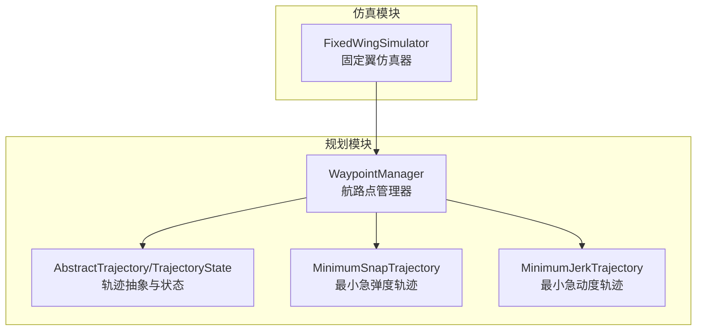
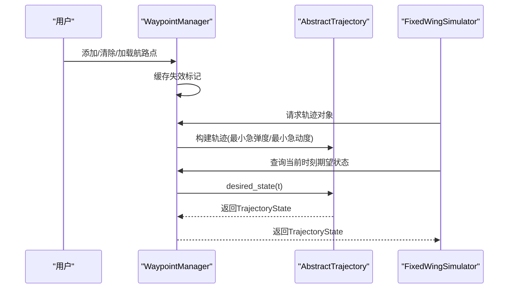
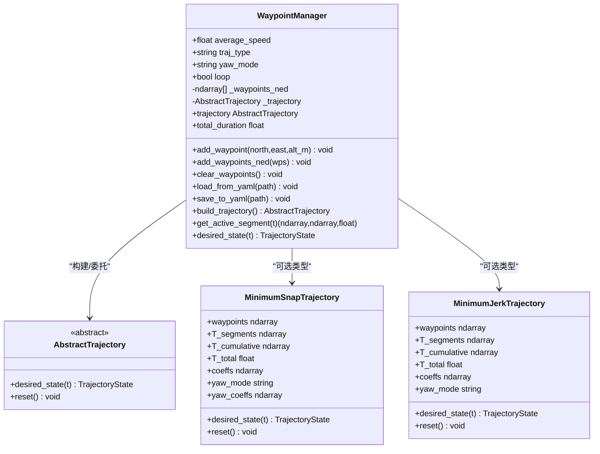
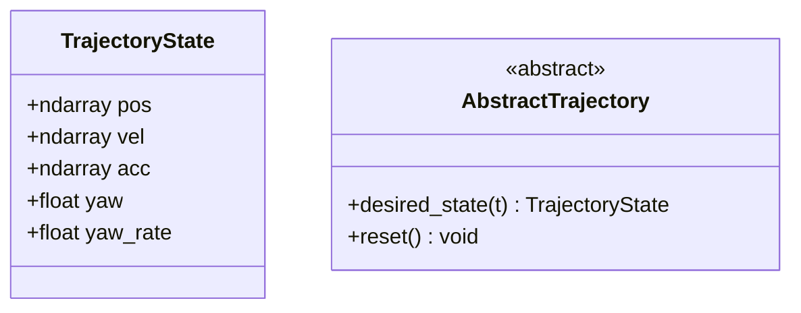
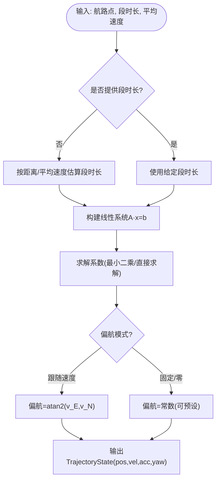
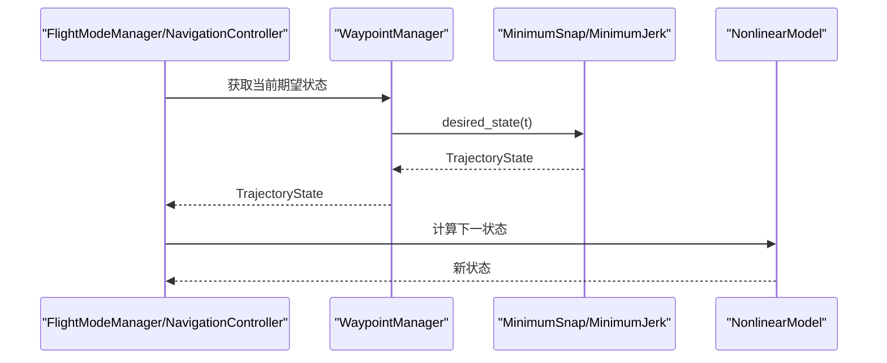
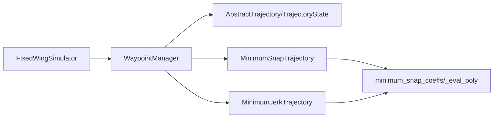

# 航路点管理器

<cite>
**本文档引用的文件**
- [src/planning/waypoint_manager.py](file://src/planning/waypoint_manager.py)
- [src/planning/trajectory_base.py](file://src/planning/trajectory_base.py)
- [src/planning/minimum_snap.py](file://src/planning/minimum_snap.py)
- [src/planning/minimum_jerk.py](file://src/planning/minimum_jerk.py)
- [src/simulation/simulator.py](file://src/simulation/simulator.py)
- [config/trajectory.yaml](file://config/trajectory.yaml)
- [tests/test_planning.py](file://tests/test_planning.py)
- [examples/example_4_circuit_flight.py](file://examples/example_4_circuit_flight.py)
- [main.py](file://main.py)
</cite>

## 目录
1. [简介](#简介)
2. [项目结构](#项目结构)
3. [核心组件](#核心组件)
4. [架构总览](#架构总览)
5. [详细组件分析](#详细组件分析)
6. [依赖关系分析](#依赖关系分析)
7. [性能考虑](#性能考虑)
8. [故障排查指南](#故障排查指南)
9. [结论](#结论)
10. [附录](#附录)

## 简介
本文件为航路点管理器（WaypointManager）的详细技术文档，聚焦于其在轨迹规划系统中的协调作用与数据结构设计。航路点管理器负责：
- 维护NED坐标系下的航路点序列（北、东、下）
- 将正上方向的海拔高度转换为NED“下”分量
- 根据航路点序列构建最小急动度或最小急弹度轨迹对象
- 提供当前时刻的期望状态（位置、速度、加速度、偏航角等）
- 支持航路点的增删改与YAML导入导出
- 与仿真器协同，在闭环控制中作为轨迹生成与跟踪的桥梁

## 项目结构
航路点管理器位于规划模块中，与轨迹基类、最小急动度/急弹度轨迹实现以及仿真器紧密协作。关键文件与职责如下：
- planning/waypoint_manager.py：航路点管理器主体，负责航路点存储、轨迹构建与查询
- planning/trajectory_base.py：轨迹抽象接口与状态数据结构
- planning/minimum_snap.py：最小急弹度轨迹实现（4阶导数最小）
- planning/minimum_jerk.py：最小急动度轨迹实现（3阶导数最小）
- simulation/simulator.py：仿真器集成航路点管理器，协调控制链路
- config/trajectory.yaml：航路点配置示例（YAML格式）
- tests/test_planning.py：单元测试，覆盖航路点管理器与轨迹生成
- examples/example_4_circuit_flight.py：航路点使用示例（非多项式航路点序列模式）

图表来源
- [src/planning/waypoint_manager.py](file://src/planning/waypoint_manager.py#L20-L208)
- [src/planning/trajectory_base.py](file://src/planning/trajectory_base.py#L16-L47)
- [src/planning/minimum_snap.py](file://src/planning/minimum_snap.py#L167-L253)
- [src/planning/minimum_jerk.py](file://src/planning/minimum_jerk.py#L17-L71)
- [src/simulation/simulator.py](file://src/simulation/simulator.py#L218-L230)

章节来源
- [src/planning/waypoint_manager.py](file://src/planning/waypoint_manager.py#L1-L208)
- [src/simulation/simulator.py](file://src/simulation/simulator.py#L218-L230)

## 核心组件
- WaypointManager：航路点管理器，维护NED航路点列表，构建并缓存轨迹对象，提供当前时刻期望状态与活动航段信息
- AbstractTrajectory/TrajectoryState：轨迹抽象接口与状态数据结构，统一输出位置、速度、加速度与偏航角
- MinimumSnapTrajectory/MinimumJerkTrajectory：两类轨迹生成器，分别基于最小急弹度与最小急动度优化
- FixedWingSimulator：仿真器，持有WaypointManager实例，并在运行时根据配置选择轨迹模式或航路点序列模式

章节来源
- [src/planning/waypoint_manager.py](file://src/planning/waypoint_manager.py#L20-L208)
- [src/planning/trajectory_base.py](file://src/planning/trajectory_base.py#L16-L47)
- [src/planning/minimum_snap.py](file://src/planning/minimum_snap.py#L167-L253)
- [src/planning/minimum_jerk.py](file://src/planning/minimum_jerk.py#L17-L71)
- [src/simulation/simulator.py](file://src/simulation/simulator.py#L218-L230)

## 架构总览
航路点管理器在系统中的角色是“任务规划与轨迹生成的协调者”。它接收用户定义的航路点，将其转换为内部NED坐标，按需构建轨迹对象，并向仿真器提供期望状态以驱动控制回路。

图表来源
- [src/planning/waypoint_manager.py](file://src/planning/waypoint_manager.py#L127-L167)
- [src/planning/trajectory_base.py](file://src/planning/trajectory_base.py#L26-L47)
- [src/simulation/simulator.py](file://src/simulation/simulator.py#L375-L408)

## 详细组件分析

### WaypointManager：航路点管理与轨迹工厂
- 数据结构
  - 内部以NED坐标存储航路点：[north, east, down]，海拔高度以“正上”输入，内部转换为负值表示“下”
  - 航路点列表为numpy数组列表，便于矩阵运算与轨迹求解
- 关键能力
  - 添加单个/多个航路点（支持直接传入NED或输入海拔）
  - 清空航路点
  - 从YAML配置加载/保存航路点（含类型、平均速度、偏航模式、是否循环）
  - 构建轨迹对象（最小急弹度或最小急动度），并缓存
  - 查询当前活动航段（起止航路点与剩余时间）
  - 委托轨迹对象返回当前时刻期望状态
- 错误处理
  - 航路点数量少于2时报错
  - 循环模式下若首尾不闭合则自动闭合
- 接口与数据交换
  - 对外提供TrajectoryState，内部通过AbstractTrajectory统一接口访问

图表来源
- [src/planning/waypoint_manager.py](file://src/planning/waypoint_manager.py#L20-L208)
- [src/planning/trajectory_base.py](file://src/planning/trajectory_base.py#L26-L47)
- [src/planning/minimum_snap.py](file://src/planning/minimum_snap.py#L167-L253)
- [src/planning/minimum_jerk.py](file://src/planning/minimum_jerk.py#L17-L71)

章节来源
- [src/planning/waypoint_manager.py](file://src/planning/waypoint_manager.py#L20-L208)

### TrajectoryState与轨迹抽象
- TrajectoryState：统一的期望状态容器，包含位置（NED）、速度、加速度与偏航角及偏航率
- AbstractTrajectory：定义轨迹接口，所有具体轨迹实现必须提供desired_state(t)

图表来源
- [src/planning/trajectory_base.py](file://src/planning/trajectory_base.py#L16-L47)

章节来源
- [src/planning/trajectory_base.py](file://src/planning/trajectory_base.py#L16-L47)

### 最小急弹度轨迹（MinimumSnapTrajectory）
- 特性
  - 每段空间轴（N、E、D）与偏航采用2M-1阶多项式（M=4对应4阶导数最小）
  - 通过线性方程组构造边界条件与连续性约束，求解系数
  - 可选在航路点处零速（停靠模式）
  - 偏航模式支持跟随速度方向或固定偏航
- 时间分配
  - 若未显式提供各段时长，则按航路点间距离与平均速度估算
- 状态查询
  - 根据当前时刻定位所在段，计算该段局部时间并求值

图表来源
- [src/planning/minimum_snap.py](file://src/planning/minimum_snap.py#L47-L142)
- [src/planning/minimum_snap.py](file://src/planning/minimum_snap.py#L181-L250)

章节来源
- [src/planning/minimum_snap.py](file://src/planning/minimum_snap.py#L167-L253)

### 最小急动度轨迹（MinimumJerkTrajectory）
- 特性
  - 与最小急弹度共享系数求解器，仅将导数阶数设置为3（5阶多项式）
  - 偏航模式与最小急弹度一致
- 使用场景
  - 当需要更低的总急动度时优先选择

章节来源
- [src/planning/minimum_jerk.py](file://src/planning/minimum_jerk.py#L17-L71)

### 仿真器集成与运行流程
- 初始化
  - 仿真器创建WaypointManager实例，默认偏航模式为“跟随速度”，平均速度取自控制参数
- 运行模式
  - 轨迹模式：构建多项式轨迹并跟踪
  - 航路点序列模式：导航控制器直接飞向下一个航路点，到达阈值后切换
- 初始高度对齐
  - 若首个航路点与实际初始高度差异较大，会修正首个航路点以避免不必要的下降

图表来源
- [src/simulation/simulator.py](file://src/simulation/simulator.py#L375-L408)
- [src/planning/waypoint_manager.py](file://src/planning/waypoint_manager.py#L205-L208)

章节来源
- [src/simulation/simulator.py](file://src/simulation/simulator.py#L218-L408)

## 依赖关系分析
- WaypointManager依赖
  - AbstractTrajectory/TrajectoryState：统一接口与状态结构
  - MinimumSnapTrajectory/MinimumJerkTrajectory：两种轨迹实现
- 轨迹实现依赖
  - minimum_snap_coeffs：通用系数求解器
  - _eval_poly：多项式及其导数求值
- 仿真器依赖
  - WaypointManager：提供期望状态
  - 控制层：导航控制器与TECS等

图表来源
- [src/planning/waypoint_manager.py](file://src/planning/waypoint_manager.py#L15-L17)
- [src/planning/minimum_snap.py](file://src/planning/minimum_snap.py#L47-L142)
- [src/planning/minimum_jerk.py](file://src/planning/minimum_jerk.py#L14-L14)
- [src/simulation/simulator.py](file://src/simulation/simulator.py#L218-L230)

章节来源
- [src/planning/waypoint_manager.py](file://src/planning/waypoint_manager.py#L15-L17)
- [src/planning/minimum_snap.py](file://src/planning/minimum_snap.py#L47-L142)
- [src/planning/minimum_jerk.py](file://src/planning/minimum_jerk.py#L14-L14)
- [src/simulation/simulator.py](file://src/simulation/simulator.py#L218-L230)

## 性能考虑
- 矩阵求解稳定性
  - 当段时长过大导致线性系统病态时，会打印警告并采用最小二乘求解
- 时间分配策略
  - 默认按航路点间距离与平均速度估算段时长，保证轨迹平滑且满足速度约束
- 查询效率
  - 通过累计时间表快速定位当前段，时间复杂度近似O(log N)
- 内存占用
  - 航路点列表与轨迹系数均为numpy数组，内存紧凑；缓存机制避免重复构建

章节来源
- [src/planning/minimum_snap.py](file://src/planning/minimum_snap.py#L132-L138)
- [src/planning/minimum_snap.py](file://src/planning/minimum_snap.py#L200-L205)
- [src/planning/waypoint_manager.py](file://src/planning/waypoint_manager.py#L192-L201)

## 故障排查指南
- 航路点数量不足
  - 现象：构建轨迹时报错
  - 处理：至少提供两个航路点
- 首尾不闭合的循环
  - 现象：循环模式下首尾不重合
  - 处理：管理器会在必要时自动闭合
- 初始高度不匹配
  - 现象：轨迹起点与实际初始高度差异大
  - 处理：仿真器会修正首个航路点以避免强制下降
- 导航模式选择
  - 现象：使用航路点序列模式时未加载航路点
  - 处理：确保先调用clear/add/load后再run

章节来源
- [src/planning/waypoint_manager.py](file://src/planning/waypoint_manager.py#L139-L145)
- [src/simulation/simulator.py](file://src/simulation/simulator.py#L386-L392)
- [tests/test_planning.py](file://tests/test_planning.py#L289-L294)

## 结论
航路点管理器在本系统中承担了“任务到轨迹”的桥梁角色：以NED坐标与正上海拔的统一约定管理航路点，按需构建最小急弹度或最小急动度轨迹，并向仿真器提供期望状态。其设计兼顾了灵活性（支持多种轨迹类型与偏航模式）、可扩展性（抽象接口与缓存机制）与工程实用性（稳健的数值求解与初始高度对齐）。通过YAML配置与示例脚本，用户可以方便地定义、导入/导出与调试航路点序列。

## 附录

### 航路点数据结构与存储格式
- 存储格式
  - NED坐标：[north, east, down]（米）
  - 海拔高度：以“正上”输入，内部转换为负值表示“下”
- YAML配置字段
  - type：轨迹类型（minimum_snap/minimum_jerk）
  - average_speed：平均速度（用于估算段时长）
  - yaw_mode：偏航模式（yaw_follow/zero/fixed）
  - loop：是否循环
  - waypoints：航路点列表，每个元素为[north, east, alt_m]

章节来源
- [src/planning/waypoint_manager.py](file://src/planning/waypoint_manager.py#L24-L25)
- [src/planning/waypoint_manager.py](file://src/planning/waypoint_manager.py#L80-L121)
- [config/trajectory.yaml](file://config/trajectory.yaml#L3-L22)

### 航路点编辑与修改方法
- 动态添加
  - 单个：add_waypoint(north, east, alt_m)
  - 批量：add_waypoints_ned((n,3)数组)
- 删除
  - clear_waypoints()
- 修改
  - 重新加载YAML：load_from_yaml(path)
  - 保存当前航路点：save_to_yaml(path)

章节来源
- [src/planning/waypoint_manager.py](file://src/planning/waypoint_manager.py#L54-L121)

### 航路点之间的连接关系与路径规划策略
- 连接关系
  - 相邻航路点之间形成分段多项式轨迹
  - 支持在中间航路点处强制零速（停靠模式）
- 规划策略
  - 最小急弹度：追求加速度变化最小，适合高动态性能
  - 最小急动度：追求急动度最小，适合平滑飞行
  - 偏航模式：跟随速度方向或固定偏航

章节来源
- [src/planning/minimum_snap.py](file://src/planning/minimum_snap.py#L52-L142)
- [src/planning/minimum_jerk.py](file://src/planning/minimum_jerk.py#L24-L48)

### 航路点验证与冲突检测机制
- 验证
  - 数量校验：至少两个航路点
  - 循环闭合：首尾近似相等时自动闭合
- 冲突检测
  - 本模块未内置几何冲突检测（如航路点间距过小导致轨迹不可行）
  - 建议在外部进行航路点合理性检查（例如最小间距、最大坡度等）

章节来源
- [src/planning/waypoint_manager.py](file://src/planning/waypoint_manager.py#L139-L145)
- [tests/test_planning.py](file://tests/test_planning.py#L289-L294)

### 与轨迹生成算法的接口与数据交换
- 接口
  - WaypointManager.trajectory：返回已构建或新构建的轨迹对象
  - WaypointManager.desired_state(t)：委托轨迹对象返回当前时刻期望状态
- 数据交换
  - 输入：航路点（NED）、段时长（可选）、平均速度、偏航模式
  - 输出：TrajectoryState（pos, vel, acc, yaw, yaw_rate）

章节来源
- [src/planning/waypoint_manager.py](file://src/planning/waypoint_manager.py#L127-L167)
- [src/planning/waypoint_manager.py](file://src/planning/waypoint_manager.py#L205-L208)
- [src/planning/trajectory_base.py](file://src/planning/trajectory_base.py#L16-L47)

### 航路点导入导出与格式转换
- 导入
  - load_from_yaml(path)：从YAML读取航路点与配置
- 导出
  - save_to_yaml(path)：将当前航路点与配置写入YAML
- 格式转换
  - 海拔高度与NED“下”分量的转换由管理器内部完成

章节来源
- [src/planning/waypoint_manager.py](file://src/planning/waypoint_manager.py#L80-L121)
- [config/trajectory.yaml](file://config/trajectory.yaml#L12-L22)

### 使用示例与最佳实践
- 示例脚本
  - examples/example_4_circuit_flight.py：演示航路点序列模式（非多项式轨迹）
- 最佳实践
  - 先clear_waypoints，再逐个add_waypoint或load_from_yaml
  - 使用合适的平均速度以平衡段时长与轨迹平滑度
  - 在闭环仿真前确认航路点顺序与偏航模式符合预期

章节来源
- [examples/example_4_circuit_flight.py](file://examples/example_4_circuit_flight.py#L103-L122)
- [main.py](file://main.py#L69-L73)