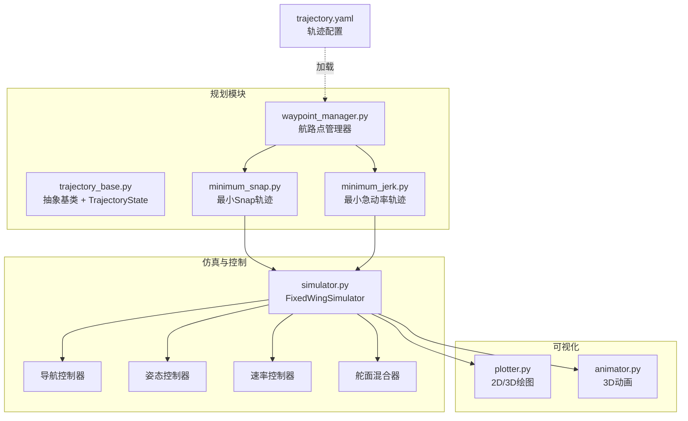
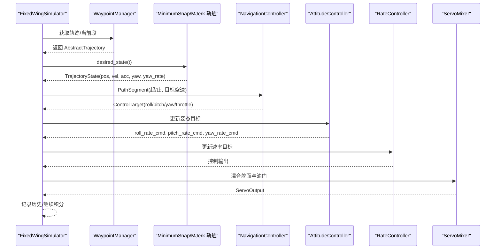
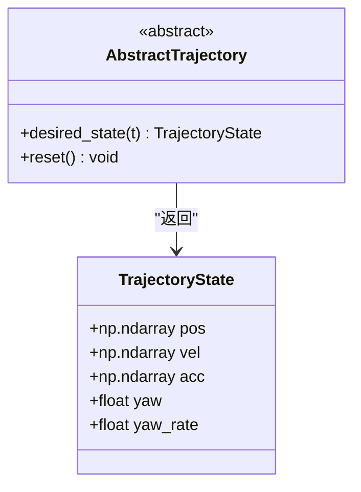
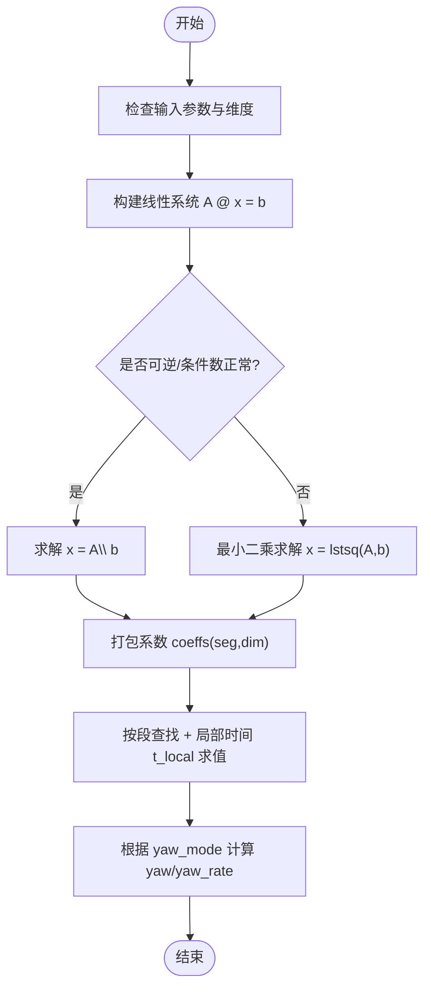
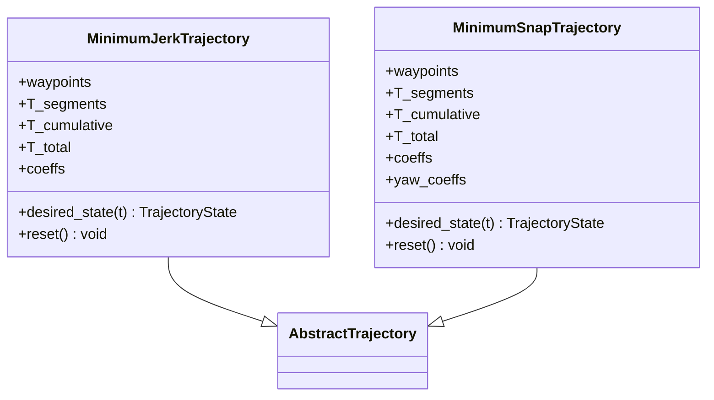
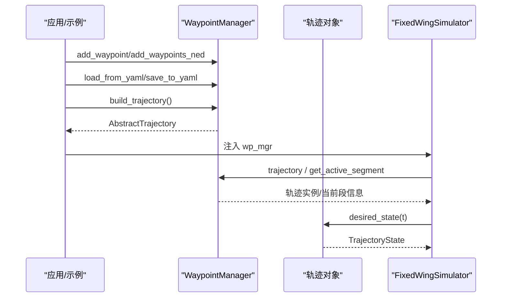
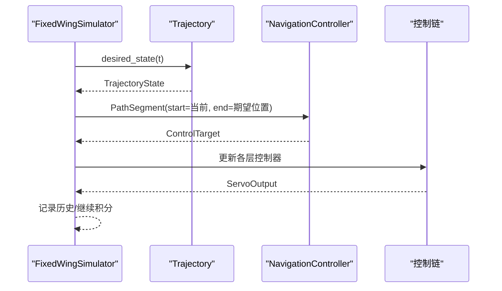
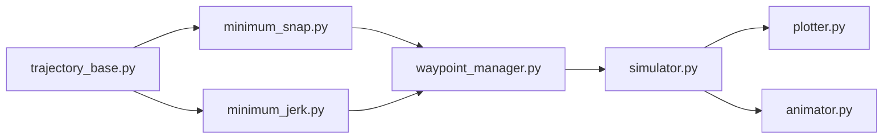

# 规划系统

<cite>
**本文引用的文件**
- [trajectory_base.py](file://src/planning/trajectory_base.py)
- [minimum_snap.py](file://src/planning/minimum_snap.py)
- [minimum_jerk.py](file://src/planning/minimum_jerk.py)
- [waypoint_manager.py](file://src/planning/waypoint_manager.py)
- [trajectory.yaml](file://config/trajectory.yaml)
- [__init__.py](file://src/planning/__init__.py)
- [simulator.py](file://src/simulation/simulator.py)
- [animator.py](file://src/visualization/animator.py)
- [plotter.py](file://src/visualization/plotter.py)
- [example_3_trajectory_tracking.py](file://examples/example_3_trajectory_tracking.py)
- [test_planning.py](file://tests/test_planning.py)
- [main.py](file://main.py)
</cite>

## 目录
1. [引言](#引言)
2. [项目结构](#项目结构)
3. [核心组件](#核心组件)
4. [架构总览](#架构总览)
5. [详细组件分析](#详细组件分析)
6. [依赖关系分析](#依赖关系分析)
7. [性能考量](#性能考量)
8. [故障排查指南](#故障排查指南)
9. [结论](#结论)
10. [附录](#附录)

## 引言
本文件面向固定翼飞行器轨迹规划系统，围绕“轨迹基类设计、最小急弹率（最小急动率）与最小Snap轨迹算法、航路点管理器、参数与约束、轨迹质量评估与可视化、以及规划与控制接口”等主题，提供系统化、可操作的技术文档。读者无需深入数学背景即可理解系统架构与使用方式。

## 项目结构
规划子系统位于 src/planning，主要由以下模块组成：
- 轨迹基类与状态：定义统一的轨迹接口与期望状态结构
- 最小Snap与最小急动率轨迹：基于分段多项式的轨迹生成器
- 航路点管理器：负责航路点的增删改查、配置加载/保存、轨迹对象构建与当前路径段查询
- 配置文件：提供默认轨迹类型、航路点列表、航向模式等
- 可视化：提供3D动画与2D/3D轨迹图
- 示例与测试：演示闭环跟踪、验证轨迹连续性与边界条件

图表来源
- [waypoint_manager.py](file://src/planning/waypoint_manager.py#L1-L208)
- [minimum_snap.py](file://src/planning/minimum_snap.py#L1-L253)
- [minimum_jerk.py](file://src/planning/minimum_jerk.py#L1-L71)
- [trajectory_base.py](file://src/planning/trajectory_base.py#L1-L47)
- [simulator.py](file://src/simulation/simulator.py#L1-L642)
- [plotter.py](file://src/visualization/plotter.py#L1-L244)
- [animator.py](file://src/visualization/animator.py#L1-L150)
- [trajectory.yaml](file://config/trajectory.yaml#L1-L23)

章节来源
- [__init__.py](file://src/planning/__init__.py#L1-L14)
- [trajectory.yaml](file://config/trajectory.yaml#L1-L23)

## 核心组件
- 轨迹基类与状态
  - 抽象基类 AbstractTrajectory 定义 desired_state(t) 接口，返回 TrajectoryState
  - TrajectoryState 包含位置、速度、加速度三维向量与偏航角及偏航率
- 最小Snap轨迹
  - 分段 2M-1 次多项式（M=4 对应最小Snap），支持边界条件与连续性约束
  - 提供系数求解函数与多项式求值辅助函数
- 最小急动率轨迹
  - 通过 deriv_order=3 的最小Snap求解器复用，得到每段五次多项式
  - 支持航向跟随模式与按平均速度估算段时长
- 航路点管理器
  - 维护 NED 航路点列表（海拔为正上，内部转换为NED负Down）
  - 构建轨迹对象、缓存轨迹、查询当前路径段、YAML导入导出
  - 支持循环模式与航向模式选择

章节来源
- [trajectory_base.py](file://src/planning/trajectory_base.py#L16-L47)
- [minimum_snap.py](file://src/planning/minimum_snap.py#L47-L142)
- [minimum_jerk.py](file://src/planning/minimum_jerk.py#L24-L71)
- [waypoint_manager.py](file://src/planning/waypoint_manager.py#L20-L208)

## 架构总览
规划系统与仿真/控制的集成路径如下：
- 固定翼仿真器在初始化时创建 WaypointManager，并根据配置或用户添加的航路点构建轨迹对象
- 在每次仿真步进中，若启用轨迹跟踪，则从轨迹对象查询 desired_state(t)，并将期望位置（必要时裁剪到当前段高程范围）送入导航控制器
- 导航控制器输出控制目标，经姿态/速率/舵面混合器转化为实际控制输入，驱动非线性动力学积分

图表来源
- [simulator.py](file://src/simulation/simulator.py#L478-L555)
- [waypoint_manager.py](file://src/planning/waypoint_manager.py#L127-L208)
- [minimum_snap.py](file://src/planning/minimum_snap.py#L227-L250)
- [minimum_jerk.py](file://src/planning/minimum_jerk.py#L50-L68)

## 详细组件分析

### 轨迹基类与状态设计
- 设计要点
  - 使用数据类封装期望状态，字段明确且默认零向量，便于直接用于控制链
  - 抽象接口统一不同轨迹类型的调用方式，便于替换与扩展
- 数据结构复杂度
  - 状态查询为 O(1)，无额外存储开销
- 错误处理
  - reset 方法为空实现，便于派生类覆盖
- 性能影响
  - 结构简单，调用开销极低；建议在高频仿真中避免重复构造状态对象

图表来源
- [trajectory_base.py](file://src/planning/trajectory_base.py#L16-L47)

章节来源
- [trajectory_base.py](file://src/planning/trajectory_base.py#L16-L47)

### 最小Snap轨迹算法
- 数学原理
  - 每轴在每段使用 2M-1 次多项式（M=4 得到最小Snap），满足起点/终点位置与边界导数约束
  - 中间节点处保证足够阶导数连续（通常为 2M-1 阶）
  - 可选在中间航路点强制速度为零（stop_at_waypoints）
- 实现要点
  - 系数求解：构建线性方程组 Ax=b，利用数值稳定性检测与最小二乘兜底
  - 多项式求值：提供导数阶次参数，支持位置/速度/加速度查询
- 参数与约束
  - waypoints: (n,3) NED坐标
  - T_segments 或 average_speed 决定段时长
  - yaw_mode 支持零偏航、航向跟随、固定偏航
  - stop_at_waypoints 强制中间点速度为零
- 性能与稳定性
  - 当段时长过大可能导致矩阵病态，代码内置警告与最小二乘兜底
  - 建议合理设置平均速度，避免过长段时长

图表来源
- [minimum_snap.py](file://src/planning/minimum_snap.py#L47-L142)
- [minimum_snap.py](file://src/planning/minimum_snap.py#L145-L164)

章节来源
- [minimum_snap.py](file://src/planning/minimum_snap.py#L47-L142)
- [minimum_snap.py](file://src/planning/minimum_snap.py#L145-L164)

### 最小急动率轨迹（最小Jerk）
- 特点
  - 通过 deriv_order=3 复用最小Snap求解器，得到每段五次多项式
  - 与最小Snap相比，自由度更大，通常能获得更平滑的加速度变化
- 适用场景
  - 固定翼对加速度变化敏感，最小急动率可降低控制输入的抖动与能耗
  - 适合需要平滑轨迹的航拍/监视任务
- 与最小Snap的关系
  - 接口一致，仅在求解器参数 deriv_order 上差异
  - 两者均支持航向跟随模式与段时长估计

图表来源
- [minimum_jerk.py](file://src/planning/minimum_jerk.py#L17-L71)
- [minimum_snap.py](file://src/planning/minimum_snap.py#L167-L253)

章节来源
- [minimum_jerk.py](file://src/planning/minimum_jerk.py#L17-L71)
- [minimum_snap.py](file://src/planning/minimum_snap.py#L167-L253)

### 航路点管理器（WaypointManager）
- 功能
  - 添加单个/批量航路点（NED格式，海拔正上转为负Down）
  - 从YAML加载/保存航路点与轨迹配置
  - 构建轨迹对象（最小Snap或最小急动率），缓存并按需重建
  - 查询当前活动段（起止航路点与剩余时间）
  - 提供便捷 desired_state(t) 代理
- 数据结构
  - _waypoints_ned: List[np.ndarray] 存储NED航路点
  - _trajectory: Optional[AbstractTrajectory] 缓存轨迹对象
- 参数与约束
  - average_speed 用于估算段时长
  - traj_type: minimum_snap | minimum_jerk
  - yaw_mode: zero | yaw_follow | fixed
  - loop: 是否闭合回环
- 与配置文件交互
  - trajectory.yaml 提供默认类型、航速、航向模式、航路点列表与循环标志

图表来源
- [waypoint_manager.py](file://src/planning/waypoint_manager.py#L54-L208)
- [trajectory.yaml](file://config/trajectory.yaml#L1-L23)

章节来源
- [waypoint_manager.py](file://src/planning/waypoint_manager.py#L20-L208)
- [trajectory.yaml](file://config/trajectory.yaml#L1-L23)

### 轨迹生成参数与约束处理
- 段时长估计
  - 若未显式提供 T_segments，则依据相邻航路点距离与平均速度计算，保证最小段时长阈值
- 边界与连续性
  - 起/末位置约束与边界导数约束（最小Snap为前deriv_order-1阶，最小急动率为前2阶）
  - 中间节点处保证足够阶导数连续；可选强制中间点速度为零
- 航向模式
  - zero：偏航角恒为0
  - yaw_follow：偏航角与水平速度方向一致（NE平面）
  - fixed：使用独立的航向轨迹（通过额外的yaw_coeffs求解）

章节来源
- [minimum_snap.py](file://src/planning/minimum_snap.py#L181-L224)
- [minimum_jerk.py](file://src/planning/minimum_jerk.py#L24-L48)

### 轨迹质量评估与可视化
- 质量评估（建议指标）
  - 总急动率/急弹率：对加速度/加加速度的范数进行离散积分，越小越平滑
  - 连续性：检查速度/加速度在段边界处的连续性误差
  - 航向平滑：偏航角变化率的均方根
  - 高程约束：期望高度与航段两端目标高度的夹紧误差
- 可视化
  - 3D轨迹动画：显示实际轨迹、期望轨迹、航路点与飞机姿态
  - 2D/3D图：位置、速度、姿态、控制输入与3D轨迹图
  - 示例脚本自动保存图像与CSV数据

图表来源
- [animator.py](file://src/visualization/animator.py#L25-L150)
- [plotter.py](file://src/visualization/plotter.py#L114-L244)
- [example_3_trajectory_tracking.py](file://examples/example_3_trajectory_tracking.py#L112-L194)

章节来源
- [animator.py](file://src/visualization/animator.py#L1-L150)
- [plotter.py](file://src/visualization/plotter.py#L1-L244)
- [example_3_trajectory_tracking.py](file://examples/example_3_trajectory_tracking.py#L1-L194)

### 规划与控制系统接口与数据交换
- 接口
  - 固定翼仿真器在每个时间步从轨迹对象查询 desired_state(t)
  - 将期望位置（必要时裁剪到当前段高程范围）作为导航控制器的目标路径段端点
  - 导航控制器输出控制目标，经姿态/速率/舵面混合器转换为实际控制输入
- 数据交换
  - 轨迹侧：TrajectoryState（pos, vel, acc, yaw, yaw_rate）
  - 控制侧：ControlTarget（roll_cmd, pitch_cmd, yaw_cmd, throttle_cmd）
  - 仿真侧：记录 des_pos（期望位置）以便可视化对比

图表来源
- [simulator.py](file://src/simulation/simulator.py#L478-L555)

章节来源
- [simulator.py](file://src/simulation/simulator.py#L219-L555)

## 依赖关系分析
- 模块内聚与耦合
  - 轨迹基类与状态与具体轨迹实现解耦，便于替换
  - WaypointManager 依赖最小Snap/最小急动率轨迹类，但不关心具体实现细节
  - 仿真器通过抽象接口与规划模块交互，耦合度低
- 外部依赖
  - NumPy 用于数值计算
  - 可选 Matplotlib/Plotly 用于可视化
- 循环依赖
  - 未发现循环导入；规划模块不反向依赖仿真器

图表来源
- [trajectory_base.py](file://src/planning/trajectory_base.py#L1-L47)
- [minimum_snap.py](file://src/planning/minimum_snap.py#L1-L253)
- [minimum_jerk.py](file://src/planning/minimum_jerk.py#L1-L71)
- [waypoint_manager.py](file://src/planning/waypoint_manager.py#L1-L208)
- [simulator.py](file://src/simulation/simulator.py#L1-L642)
- [plotter.py](file://src/visualization/plotter.py#L1-L244)
- [animator.py](file://src/visualization/animator.py#L1-L150)

章节来源
- [__init__.py](file://src/planning/__init__.py#L1-L14)

## 性能考量
- 矩阵求解稳定性
  - 当段时长过大可能造成矩阵病态，系统内置条件数检测与最小二乘兜底
  - 建议合理设置平均速度，避免极端长段
- 时间复杂度
  - 系数求解为 O(n^3)（n 为每段未知数数量），通常 n 不大，实时性良好
  - 每步查询为 O(log s)（二分查找段索引）+ O(1) 求值
- 内存占用
  - 主要为轨迹系数数组与航路点列表，规模与航路点数量线性相关
- 优化建议
  - 合理划分航路点密度，避免过多短段导致求解器频繁更新
  - 在高精度需求下优先选择最小Snap，对平滑性要求更高时选择最小急动率

## 故障排查指南
- 常见问题
  - 轨迹构建报错：至少需要两个航路点；检查航路点数量与维度
  - 航向异常：确认 yaw_mode 设置与速度方向；当速度过低时航向跟随模式会退化
  - 轨迹不平滑：增大航路点密度或切换到最小Snap；检查段时长是否过大
  - 可视化缺失：确保安装了 Matplotlib/Plotly；示例脚本会自动保存图像
- 单元测试参考
  - 测试覆盖了系数形状、边界满足、连续性、有限性与航向模式等关键点
- 命令行入口
  - main.py 支持多种运行模式与轨迹类型选择，便于快速验证

章节来源
- [test_planning.py](file://tests/test_planning.py#L51-L328)
- [main.py](file://main.py#L32-L95)

## 结论
该规划系统以抽象基类统一接口，结合最小Snap与最小急动率两类轨迹生成器，配合航路点管理器与可视化工具，形成完整的固定翼轨迹规划与闭环仿真链路。系统在保证数学严谨性的同时，提供了良好的工程可用性与扩展空间。对于固定翼飞行器而言，最小急动率轨迹在平滑性与控制友好性方面具有明显优势，适合对动态响应有较高要求的任务场景。

## 附录
- 使用示例
  - 示例脚本展示了如何在仿真器中加载航路点并进行闭环跟踪，同时生成多类图表与动画
- 配置文件
  - trajectory.yaml 提供默认轨迹类型、航速、航向模式、航路点列表与循环标志，便于快速启动

章节来源
- [example_3_trajectory_tracking.py](file://examples/example_3_trajectory_tracking.py#L72-L194)
- [trajectory.yaml](file://config/trajectory.yaml#L1-L23)