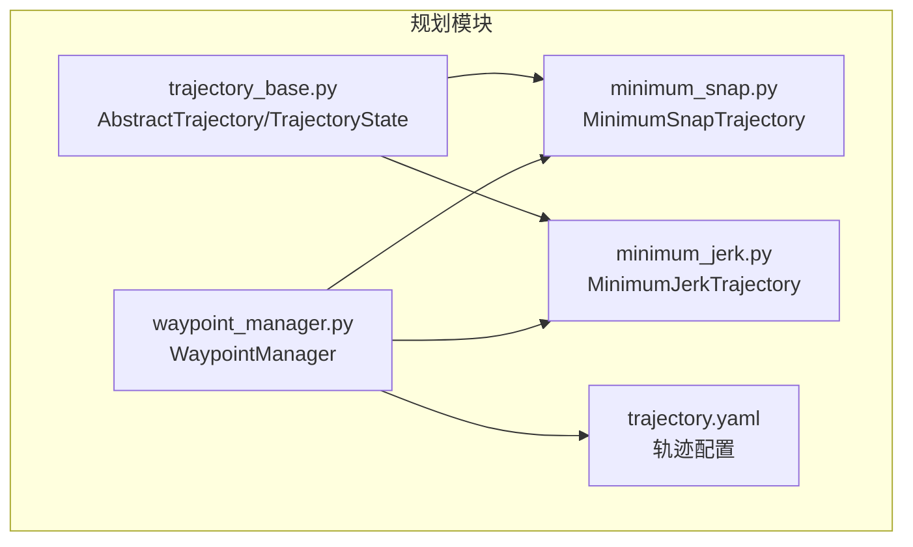
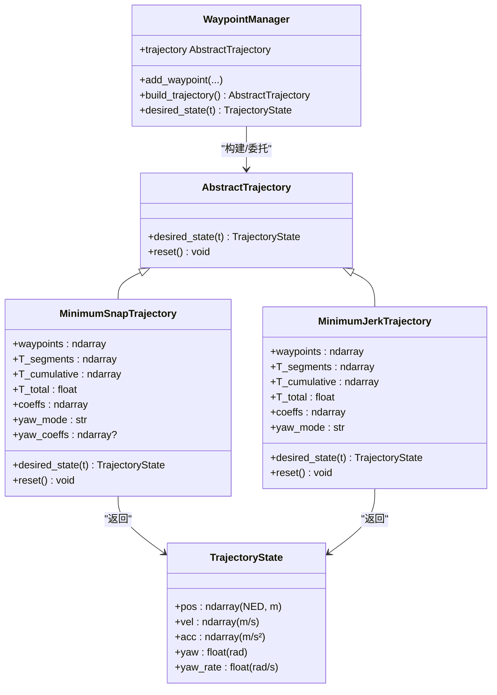
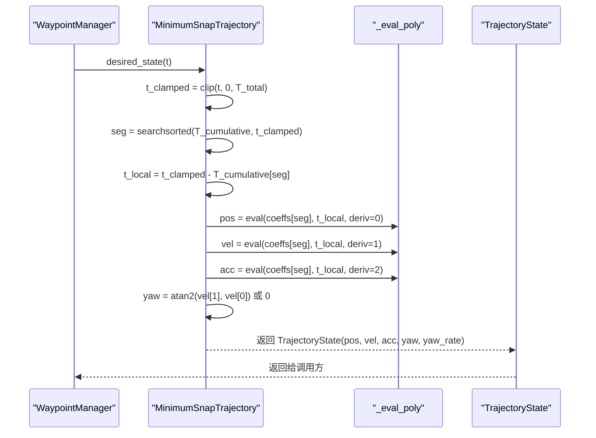
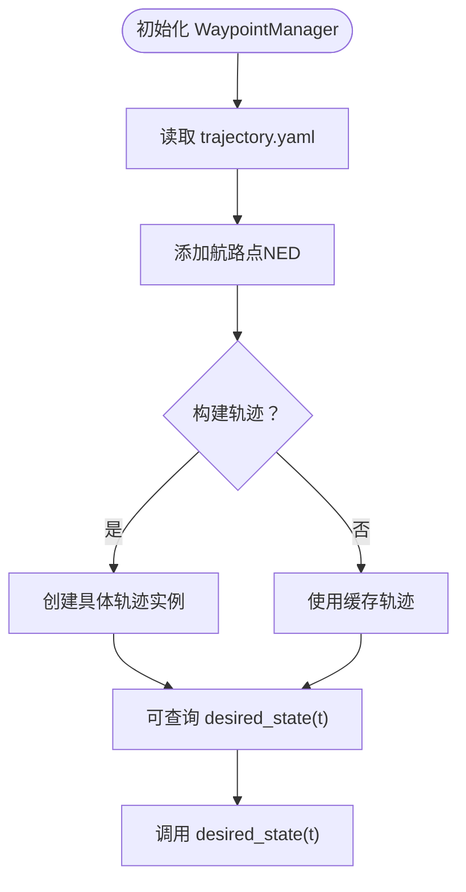
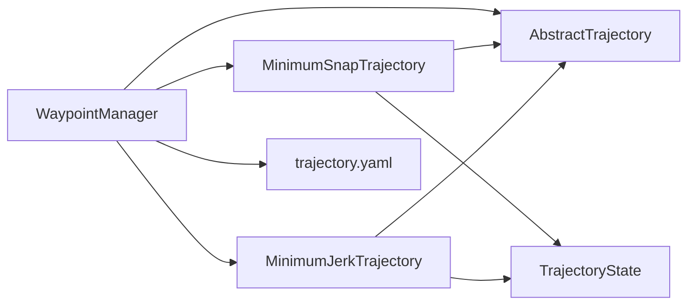

# 轨迹基类与数据结构

<cite>
**本文档引用的文件**
- [trajectory_base.py](file://src/planning/trajectory_base.py)
- [minimum_snap.py](file://src/planning/minimum_snap.py)
- [minimum_jerk.py](file://src/planning/minimum_jerk.py)
- [waypoint_manager.py](file://src/planning/waypoint_manager.py)
- [trajectory.yaml](file://config/trajectory.yaml)
- [test_planning.py](file://tests/test_planning.py)
- [example_3_trajectory_tracking.py](file://examples/example_3_trajectory_tracking.py)
- [coordinate_transform.py](file://src/dynamics/coordinate_transform.py)
- [math_utils.py](file://src/utils/math_utils.py)
</cite>

## 目录
1. [引言](#引言)
2. [项目结构](#项目结构)
3. [核心组件](#核心组件)
4. [架构总览](#架构总览)
5. [详细组件分析](#详细组件分析)
6. [依赖关系分析](#依赖关系分析)
7. [性能考虑](#性能考虑)
8. [故障排查指南](#故障排查指南)
9. [结论](#结论)
10. [附录](#附录)

## 引言
本文件聚焦于轨迹规划系统的“轨迹基类与数据结构”，系统性阐述以下主题：
- AbstractTrajectory 抽象基类的设计理念与接口规范
- TrajectoryState 数据类的字段定义、物理意义与时间依赖性
- NED 坐标系在轨迹系统中的应用与转换
- 具体轨迹类型的实现模式与扩展方法
- 轨迹状态的验证规则与边界条件处理
- 与仿真器控制链路的集成方式与典型使用场景

## 项目结构
轨迹规划模块位于 src/planning 目录，核心文件包括：
- trajectory_base.py：定义抽象基类与轨迹状态数据类
- minimum_snap.py：最小Snap轨迹实现（含多项式系数求解与评估）
- minimum_jerk.py：最小Jerk轨迹实现（复用最小Snap系数求解器）
- waypoint_manager.py：航路点管理与轨迹工厂，负责构建具体轨迹对象
- 配置文件 config/trajectory.yaml：轨迹类型、航路点、航向模式等配置
- 测试与示例：tests/test_planning.py、examples/example_3_trajectory_tracking.py 等

图表来源
- [trajectory_base.py](file://src/planning/trajectory_base.py#L1-L47)
- [minimum_snap.py](file://src/planning/minimum_snap.py#L1-L253)
- [minimum_jerk.py](file://src/planning/minimum_jerk.py#L1-L71)
- [waypoint_manager.py](file://src/planning/waypoint_manager.py#L1-L208)
- [trajectory.yaml](file://config/trajectory.yaml#L1-L23)

章节来源
- [trajectory_base.py](file://src/planning/trajectory_base.py#L1-L47)
- [waypoint_manager.py](file://src/planning/waypoint_manager.py#L1-L208)
- [trajectory.yaml](file://config/trajectory.yaml#L1-L23)

## 核心组件
本节深入解析两个核心构件：AbstractTrajectory 抽象基类与 TrajectoryState 数据类。

- AbstractTrajectory
  - 角色：所有轨迹类型的统一接口契约，强制实现 desired_state(t) 方法
  - 设计要点：通过抽象方法约束子类行为；提供 reset 可选重置机制
  - 接口语义：输入为当前仿真时间 t（秒），输出为 TrajectoryState

- TrajectoryState
  - 角色：描述某一时刻的期望轨迹状态
  - 字段与单位：
    - pos：NED 位置向量（米）
    - vel：速度向量（米/秒）
    - acc：加速度向量（米/秒²）
    - yaw：期望偏航角（弧度）
    - yaw_rate：偏航角速度（弧度/秒）
  - 时间依赖性：每个时间 t 对应唯一状态；轨迹实现需保证连续性与平滑性
  - 坐标系：pos 使用 NED（北-东-下）坐标系，与仿真器状态管理一致

章节来源
- [trajectory_base.py](file://src/planning/trajectory_base.py#L16-L47)

## 架构总览
轨迹系统采用“工厂 + 抽象基类 + 具体实现”的分层设计：
- WaypointManager 负责加载航路点、选择轨迹类型并构建具体轨迹实例
- AbstractTrajectory 定义统一接口，MinimumSnapTrajectory 与 MinimumJerkTrajectory 提供不同优化准则的轨迹
- TrajectoryState 作为跨模块的数据载体，贯穿仿真器控制链路

图表来源
- [trajectory_base.py](file://src/planning/trajectory_base.py#L16-L47)
- [minimum_snap.py](file://src/planning/minimum_snap.py#L167-L253)
- [minimum_jerk.py](file://src/planning/minimum_jerk.py#L17-L71)
- [waypoint_manager.py](file://src/planning/waypoint_manager.py#L20-L208)

## 详细组件分析

### AbstractTrajectory 抽象基类
- 设计理念
  - 统一接口：强制子类实现 desired_state(t)，确保上层控制逻辑无需关心具体轨迹细节
  - 可扩展性：通过 reset 提供内部状态重置能力，便于循环或重播场景
- 接口规范
  - 输入：t（秒），当前仿真时间
  - 输出：TrajectoryState，包含位置、速度、加速度与航向信息
- 实现建议
  - 子类应保证 desired_state 的连续性与数值稳定性
  - 对 t 的边界进行显式处理（如裁剪到 [0, T_total]）

章节来源
- [trajectory_base.py](file://src/planning/trajectory_base.py#L26-L47)

### TrajectoryState 数据类
- 字段定义与物理意义
  - pos：NED 坐标系下的三维位置（北、东、下），单位米
  - vel：NED 坐标系下的三维速度（北、东、下），单位米/秒
  - acc：NED 坐标系下的三维加速度（北、东、下），单位米/秒²
  - yaw：期望偏航角（弧度），用于姿态控制的目标航向
  - yaw_rate：期望偏航角速度（弧度/秒），用于航向动态控制
- 时间依赖性
  - 每个 t 对应唯一 TrajectoryState，轨迹实现需保证在分段多项式上的连续性
- NED 坐标系应用
  - 所有位置与速度均以 NED 表达，与仿真器状态管理保持一致，避免坐标变换误差

章节来源
- [trajectory_base.py](file://src/planning/trajectory_base.py#L16-L24)

### MinimumSnapTrajectory 最小Snap轨迹
- 实现要点
  - 分段多项式：每段为高阶多项式，满足边界与连续性约束
  - 系数求解：通过线性系统 A @ x = b 求解，支持最小Snap（4阶导数）与最小Jerk（3阶导数）
  - 评估函数：_eval_poly 计算任意阶导数（0=位置、1=速度、2=加速度）
  - 航向策略：根据 yaw_mode 决定是否跟随速度方向或固定航向
- 时间处理
  - 对 t 进行裁剪至 [0, T_total]，定位所在分段并计算局部时间 t_local
- 状态返回
  - 返回 TrajectoryState，其中 yaw/yaw_rate 由速度方向与模式决定

图表来源
- [minimum_snap.py](file://src/planning/minimum_snap.py#L227-L252)
- [minimum_snap.py](file://src/planning/minimum_snap.py#L145-L164)

章节来源
- [minimum_snap.py](file://src/planning/minimum_snap.py#L167-L253)

### MinimumJerkTrajectory 最小Jerk轨迹
- 实现要点
  - 复用 minimum_snap_coeffs，设置 deriv_order=3，得到每段5阶多项式
  - 航向策略：根据 yaw_mode 决定是否跟随速度方向
- 与 MinimumSnapTrajectory 的差异
  - 优化目标不同（Jerk vs Snap），但接口完全一致，便于替换与对比

章节来源
- [minimum_jerk.py](file://src/planning/minimum_jerk.py#L17-L71)

### WaypointManager 航路点管理与工厂
- 职责
  - 加载/保存航路点（NED格式，正向上转换为NED down）
  - 根据配置选择轨迹类型并构建具体轨迹实例
  - 提供 desired_state(t) 的便捷委托
- 关键流程
  - load_from_yaml 解析 trajectory.yaml，设置 traj_type、average_speed、yaw_mode、loop 等
  - build_trajectory 依据类型创建 MinimumSnapTrajectory 或 MinimumJerkTrajectory
  - get_active_segment 计算当前所在航段与剩余时间

图表来源
- [waypoint_manager.py](file://src/planning/waypoint_manager.py#L80-L160)
- [waypoint_manager.py](file://src/planning/waypoint_manager.py#L178-L207)

章节来源
- [waypoint_manager.py](file://src/planning/waypoint_manager.py#L20-L208)
- [trajectory.yaml](file://config/trajectory.yaml#L1-L23)

### 配置文件 trajectory.yaml
- 主要配置项
  - type：轨迹类型（minimum_snap | minimum_jerk）
  - average_speed：平均巡航速度，用于估算航段时长
  - yaw_mode：航向控制模式（none | yaw_follow | yaw_waypoint_interp | zero）
  - waypoints：航路点列表（北、东、正向上），内部转换为 NED 下
  - loop：是否循环回到起点
- 与 WaypointManager 的交互
  - load_from_yaml 将配置映射到 WaypointManager 的属性

章节来源
- [trajectory.yaml](file://config/trajectory.yaml#L1-L23)
- [waypoint_manager.py](file://src/planning/waypoint_manager.py#L80-L122)

### 坐标系与转换
- NED 约定
  - NED（North-East-Down）为正交坐标系，常用于飞行器导航
  - 本系统中位置与速度均以 NED 表达，确保与仿真器状态一致
- 体轴与NED转换
  - 提供 body_to_ned 与 ned_to_body 的矩阵变换工具，支持 Euler 角（φ, θ, ψ）
  - 该能力用于仿真器动力学与控制模块，轨迹状态本身以 NED 描述

章节来源
- [coordinate_transform.py](file://src/dynamics/coordinate_transform.py#L1-L69)
- [math_utils.py](file://src/utils/math_utils.py#L47-L90)

## 依赖关系分析
- 模块耦合
  - AbstractTrajectory 与 TrajectoryState 是核心契约与数据载体，被所有轨迹实现依赖
  - WaypointManager 依赖 AbstractTrajectory 与具体轨迹实现，并与配置文件交互
  - 最小Snap/最小Jerk实现共享系数求解与评估函数，降低重复代码
- 外部依赖
  - NumPy 用于向量化计算与数组操作
  - YAML 用于配置文件解析

图表来源
- [waypoint_manager.py](file://src/planning/waypoint_manager.py#L15-L18)
- [minimum_snap.py](file://src/planning/minimum_snap.py#L21-L22)
- [minimum_jerk.py](file://src/planning/minimum_jerk.py#L13-L14)
- [trajectory_base.py](file://src/planning/trajectory_base.py#L10-L13)

章节来源
- [waypoint_manager.py](file://src/planning/waypoint_manager.py#L1-L208)
- [minimum_snap.py](file://src/planning/minimum_snap.py#L1-L253)
- [minimum_jerk.py](file://src/planning/minimum_jerk.py#L1-L71)
- [trajectory_base.py](file://src/planning/trajectory_base.py#L1-L47)

## 性能考虑
- 系数求解稳定性
  - 当航段时长较大时，线性系统可能病态，测试用例验证了系数的有限性
- 时间查询效率
  - 使用二分查找定位分段，复杂度 O(log n)，适合实时仿真
- 数值精度
  - 对速度方向阈值进行保护（如大于0.5的阈值），避免航向在低速时抖动

章节来源
- [test_planning.py](file://tests/test_planning.py#L109-L116)
- [minimum_snap.py](file://src/planning/minimum_snap.py#L227-L252)

## 故障排查指南
- 常见问题与处理
  - 航路点数量不足：构建轨迹前至少需要2个航路点，否则抛出异常
  - 轨迹类型未知：传入不支持的 traj_type 将触发错误
  - 时间越界：对 t 的裁剪确保返回合法状态，避免越界访问
  - 航向模式：当速度幅值过低时，航向可能被置零，避免无效航向
- 验证建议
  - 使用测试用例思路验证：起止点一致性、中间航路点处的位置连续性、速度/加速度的有限性
  - 对长时间段进行稳定性检查，确认系数有限且轨迹连续

章节来源
- [waypoint_manager.py](file://src/planning/waypoint_manager.py#L127-L159)
- [test_planning.py](file://tests/test_planning.py#L122-L171)
- [minimum_jerk.py](file://src/planning/minimum_jerk.py#L50-L67)

## 结论
本系统通过 AbstractTrajectory 抽象基类与 TrajectoryState 数据类，建立了清晰、可扩展的轨迹规划框架。MinimumSnapTrajectory 与 MinimumJerkTrajectory 提供了两种优化准则的轨迹实现，WaypointManager 则承担了航路点管理与轨迹工厂的角色。NED 坐标系与统一的状态接口，使得轨迹状态能够无缝接入仿真器的控制链路。通过严格的边界处理与数值稳定性保障，系统在工程实践中具备良好的可靠性与可维护性。

## 附录

### 如何实现自定义轨迹类型
- 步骤
  - 新建类继承 AbstractTrajectory
  - 实现 desired_state(t)：返回 TrajectoryState，确保 pos/vel/acc/yaw/yaw_rate 合理
  - 如有内部状态，实现 reset() 进行重置
  - 在 WaypointManager 中注册新轨迹类型，或直接在业务代码中构造并使用
- 注意事项
  - 保持 desired_state 的连续性与数值稳定性
  - 明确时间范围与边界处理策略
  - 与 NED 坐标系保持一致，避免坐标混用

章节来源
- [trajectory_base.py](file://src/planning/trajectory_base.py#L26-L47)
- [waypoint_manager.py](file://src/planning/waypoint_manager.py#L127-L160)

### 示例：轨迹跟踪运行流程
- WaypointManager 读取 trajectory.yaml 并构建轨迹
- FixedWingSimulator 在 AUTO 模式下周期调用 desired_state(t)
- 控制链路基于 TrajectoryState 生成控制指令，驱动飞机跟踪期望轨迹

章节来源
- [example_3_trajectory_tracking.py](file://examples/example_3_trajectory_tracking.py#L70-L98)
- [waypoint_manager.py](file://src/planning/waypoint_manager.py#L205-L207)