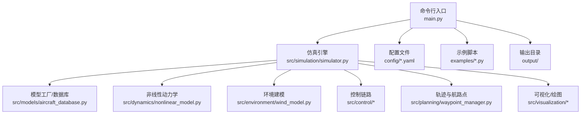
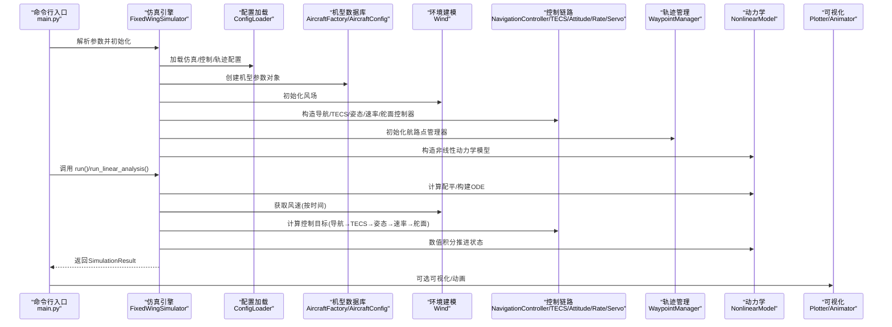
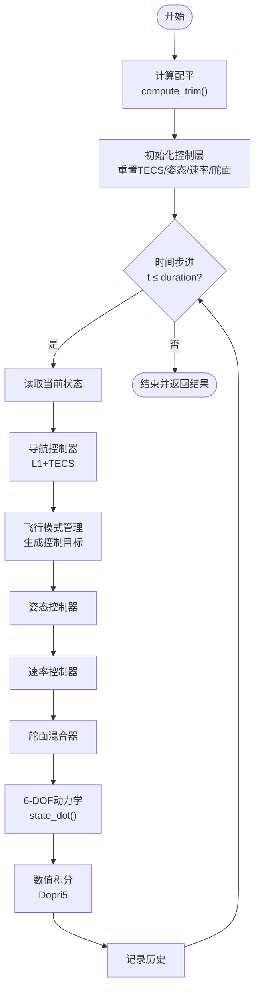
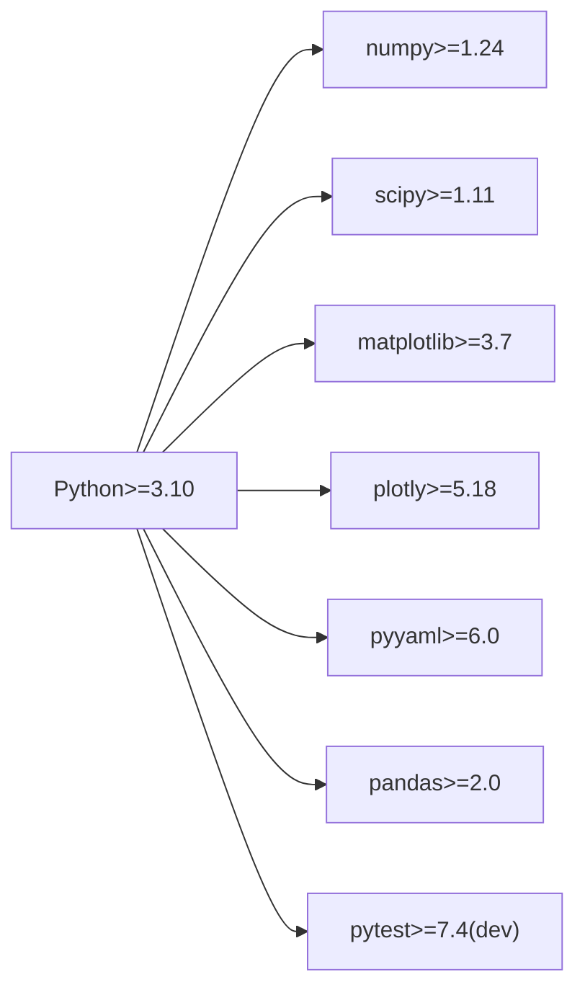

# 项目概述

<cite>
**本文引用的文件**
- [main.py](file://main.py)
- [setup.py](file://setup.py)
- [requirements.txt](file://requirements.txt)
- [config/aircraft.yaml](file://config/aircraft.yaml)
- [config/simulation.yaml](file://config/simulation.yaml)
- [config/control_params.yaml](file://config/control_params.yaml)
- [src/simulation/simulator.py](file://src/simulation/simulator.py)
- [src/models/aircraft_database.py](file://src/models/aircraft_database.py)
- [src/dynamics/nonlinear_model.py](file://src/dynamics/nonlinear_model.py)
- [src/control/ardupilot_compat.py](file://src/control/ardupilot_compat.py)
- [src/control/navigation_controller.py](file://src/control/navigation_controller.py)
- [src/environment/wind_model.py](file://src/environment/wind_model.py)
- [src/planning/waypoint_manager.py](file://src/planning/waypoint_manager.py)
- [examples/example_1_linear_response.py](file://examples/example_1_linear_response.py)
</cite>

## 目录
1. [引言](#引言)
2. [项目结构](#项目结构)
3. [核心组件](#核心组件)
4. [架构总览](#架构总览)
5. [详细组件分析](#详细组件分析)
6. [依赖关系分析](#依赖关系分析)
7. [性能考虑](#性能考虑)
8. [故障排查指南](#故障排查指南)
9. [结论](#结论)
10. [附录](#附录)

## 引言
FixedWingSimulator 是一个专业级固定翼无人机仿真与控制平台，旨在提供高保真的6自由度（6-DOF）非线性动力学仿真，并兼容 ArduPilot 的控制链路。项目支持多机型参数数据库、完整的飞行控制层级（导航控制器、姿态/速率控制器、舵面混合器、TECS 总能量控制系统）、轨迹规划与航路点管理、风场建模以及可视化输出。其定位是面向航空航天仿真研究、教学演示、飞控算法验证与系统集成测试的综合性工具。

项目目标与价值：
- 提供可复现、可配置、可扩展的固定翼仿真环境；
- 支持从线性模型到6-DOF非线性仿真、从开环脉冲到闭环控制的全谱仿真能力；
- 通过 ArduPilot 兼容参数与控制逻辑，便于与开源飞控生态对接；
- 提供丰富的示例脚本与输出数据/图表，便于快速上手与结果分析。

## 项目结构
项目采用模块化分层组织，按“仿真引擎—动力学—控制—环境—规划—可视化”划分，核心入口位于命令行脚本，配置文件集中于 config 目录，示例位于 examples 目录，输出保存在 output 目录。

**图示来源**
- [main.py](file://main.py#L1-L145)
- [src/simulation/simulator.py](file://src/simulation/simulator.py#L1-L642)
- [src/models/aircraft_database.py](file://src/models/aircraft_database.py#L1-L183)
- [src/dynamics/nonlinear_model.py](file://src/dynamics/nonlinear_model.py#L1-L386)
- [src/environment/wind_model.py](file://src/environment/wind_model.py#L1-L113)
- [src/planning/waypoint_manager.py](file://src/planning/waypoint_manager.py#L1-L208)

**章节来源**
- [main.py](file://main.py#L1-L145)
- [config/aircraft.yaml](file://config/aircraft.yaml#L1-L13)
- [config/simulation.yaml](file://config/simulation.yaml#L1-L30)
- [config/control_params.yaml](file://config/control_params.yaml#L1-L45)

## 核心组件
- 仿真引擎：负责整合模型、控制、环境与规划模块，提供闭环/开环运行接口与结果封装。
- 动力学模块：实现6-DOF非线性方程组与线性化模型，支持配平计算与数值积分。
- 控制链路：ArduPilot 兼容参数容器与五层控制链（导航、TECS、姿态、速率、舵面），覆盖多种飞行模式。
- 环境建模：风场生成器，支持静风、定常风、正弦扰动与随机正弦扰动。
- 规划模块：航路点管理与轨迹生成（最小Snap/最小Jerk），支持航段选择与目标高度/速度约束。
- 可视化：二维/三维可视化与动画输出，支持批量运行与无头渲染。
- 配置系统：集中管理机型、仿真参数、控制参数与轨迹配置。

**章节来源**
- [src/simulation/simulator.py](file://src/simulation/simulator.py#L1-L642)
- [src/dynamics/nonlinear_model.py](file://src/dynamics/nonlinear_model.py#L1-L386)
- [src/control/ardupilot_compat.py](file://src/control/ardupilot_compat.py#L1-L130)
- [src/control/navigation_controller.py](file://src/control/navigation_controller.py#L1-L293)
- [src/environment/wind_model.py](file://src/environment/wind_model.py#L1-L113)
- [src/planning/waypoint_manager.py](file://src/planning/waypoint_manager.py#L1-L208)

## 架构总览
下图展示了从命令行入口到各子系统的调用关系与数据流：

**图示来源**
- [main.py](file://main.py#L98-L145)
- [src/simulation/simulator.py](file://src/simulation/simulator.py#L115-L642)
- [src/environment/wind_model.py](file://src/environment/wind_model.py#L18-L113)
- [src/control/navigation_controller.py](file://src/control/navigation_controller.py#L45-L293)
- [src/dynamics/nonlinear_model.py](file://src/dynamics/nonlinear_model.py#L104-L386)

## 详细组件分析

### 仿真引擎与运行流程
- 提供 run() 与 run_linear_analysis() 两种运行模式：
  - 闭环运行：构建控制目标，经五层控制链生成舵面输出，驱动6-DOF动力学积分。
  - 开环线性分析：基于线性模型进行脉冲响应与模态分析。
- 自动配平与巡航油门更新：根据当前气动与重力平衡自动调整 TECS 巡航油门，提升仿真一致性。
- 结果封装：SimulationResult 提供摘要与可视化接口，支持导出图表与数据。

**图示来源**
- [src/simulation/simulator.py](file://src/simulation/simulator.py#L239-L567)
- [src/dynamics/nonlinear_model.py](file://src/dynamics/nonlinear_model.py#L132-L255)

**章节来源**
- [src/simulation/simulator.py](file://src/simulation/simulator.py#L115-L642)

### 多机型支持与参数数据库
- 内置7种典型固定翼无人机参数（TB2、Anka、Aksungur、Karayel、Predator、Heron MK1、Heron MK2），涵盖几何、气动、惯性与马赫数等。
- 参数命名与原始项目保持一致，便于替换与扩展。
- 支持参数覆盖与派生字段注入（如动态压力、密度等）。

**章节来源**
- [src/models/aircraft_database.py](file://src/models/aircraft_database.py#L29-L183)
- [config/aircraft.yaml](file://config/aircraft.yaml#L1-L13)

### 6-DOF非线性动力学
- 状态向量：体轴速度(u,v,w)、角速度(p,q,r)、欧拉角(φ,θ,ψ)、位置(xN,xE,xD)。
- 方程组：包含气动力/力矩模型、推力模型、重力投影、欧拉角运动学与位置变换。
- 数值积分：使用 Dorminger–Prince (dopri5) 在实时循环中求解，批处理场景可用 RK45。

**章节来源**
- [src/dynamics/nonlinear_model.py](file://src/dynamics/nonlinear_model.py#L104-L386)

### ArduPilot 兼容控制链
- 参数容器：ArduPilotParams 完整映射 ArduPilot Plane 参数命名，支持 YAML 导入/导出与范围校验。
- 控制层级：
  - 导航控制器：L1 航迹跟踪 + TECS 高度/空速控制。
  - 姿态/速率控制器：三轴 PID 控制，带限幅与阻尼。
  - 舵面混合器：将控制指令转换为舵面偏角与油门。
- 飞行模式：支持 MANUAL、STABILIZE、FBW_A、FBW_B、AUTO、LOITER、RTH 等。

**章节来源**
- [src/control/ardupilot_compat.py](file://src/control/ardupilot_compat.py#L17-L130)
- [src/control/navigation_controller.py](file://src/control/navigation_controller.py#L45-L293)

### 环境建模与风场
- 支持 NONE、FIXED、SINE、RANDOMSINE 四类风场类型。
- 风向采用“来向”约定（met convention），风矢量以 NED 表示。
- 可配置平均风速与方向，SINE/RANDOMSINE 类型内置频率/相位/振幅随机初始化。

**章节来源**
- [src/environment/wind_model.py](file://src/environment/wind_model.py#L18-L113)
- [config/simulation.yaml](file://config/simulation.yaml#L22-L25)

### 轨迹规划与航路点管理
- WaypointManager 统一管理 NED 坐标系航路点，支持从 YAML 加载/保存。
- 支持最小Snap与最小Jerk轨迹，提供路径段查询与剩余时间估计。
- 提供航段式导航（绕飞航路点）与轨迹跟踪两种模式。

**章节来源**
- [src/planning/waypoint_manager.py](file://src/planning/waypoint_manager.py#L20-L208)
- [config/trajectory.yaml](file://config/trajectory.yaml#L1-L200) 仅用于示例加载，不在主流程自动加载

### 示例与使用场景
- 示例脚本展示线性模型脉冲响应与闭环 PID 对比、轨迹跟踪、环形通场、不同机型对比、风阻影响等。
- 支持批量运行与无头渲染，自动保存 CSV 数据与 PNG 图表。

**章节来源**
- [examples/example_1_linear_response.py](file://examples/example_1_linear_response.py#L1-L206)

## 依赖关系分析
- Python 版本要求：Python ≥ 3.10
- 关键依赖：numpy、scipy、matplotlib、plotly、pyyaml、pandas
- 开发依赖：pytest（可选）

**图示来源**
- [setup.py](file://setup.py#L11-L21)
- [requirements.txt](file://requirements.txt#L1-L8)

**章节来源**
- [setup.py](file://setup.py#L1-L23)
- [requirements.txt](file://requirements.txt#L1-L8)

## 性能考虑
- 数值积分：实时循环使用 dopri5（自适应步长），批处理可使用 RK45；可通过配置调整绝对/相对容差。
- 控制层积分器：速率/姿态控制器默认启用积分项，建议谨慎设置以避免极限环；项目中已对积分项进行保守配置。
- 风场计算：SINE/RANDOMSINE 使用三角函数叠加，复杂度与谐波数量相关；可按需调整。
- 可视化：无头渲染（Agg）适合批量运行，避免 GUI 占用；交互式窗口仅在需要时开启。

[本节为通用指导，不直接分析具体文件]

## 故障排查指南
- 机型名称错误：确认在内置机型列表中，或检查配置文件中的 aircraft_name。
- 风场类型非法：确保 wind_type 为 NONE/FIXED/SINE/RANDOMSINE 之一。
- 轨迹构建失败：至少需要两个航路点；若使用环路，确保首尾点闭合。
- 控制参数越界：ArduPilot 参数容器提供范围校验，越界会打印警告；请修正参数后重试。
- 数值积分报错：检查风场/密度/气动模型输入是否合理；适当缩小 dt 或调整容差。

**章节来源**
- [src/simulation/simulator.py](file://src/simulation/simulator.py#L140-L141)
- [src/environment/wind_model.py](file://src/environment/wind_model.py#L39-L41)
- [src/planning/waypoint_manager.py](file://src/planning/waypoint_manager.py#L139-L140)
- [src/control/ardupilot_compat.py](file://src/control/ardupilot_compat.py#L104-L129)

## 结论
FixedWingSimulator 以模块化架构实现了从线性到非线性的固定翼仿真，结合 ArduPilot 兼容控制链与多机型参数库，既满足教学与研究的入门需求，又具备工程化的扩展能力。通过完善的配置系统、示例脚本与可视化输出，用户可以快速搭建仿真场景、验证控制策略并生成可复用的结果。

[本节为总结性内容，不直接分析具体文件]

## 附录

### 快速开始与常用命令
- 默认运行：使用 TB2 在 AUTO 模式下进行闭环仿真。
- 指定机型/模式/风场/轨迹类型：通过命令行参数选择。
- 批量运行：添加 --no-plot 以禁用可视化，适合大规模参数扫描。
- 列出可用机型：--list-aircraft。

**章节来源**
- [main.py](file://main.py#L6-L18)
- [main.py](file://main.py#L98-L145)

### 配置文件说明
- 机型配置：指定 aircraft_name，可选覆盖部分参数。
- 仿真配置：时间步长、总时长、初始位置/航向、初始模式、风场参数、日志开关。
- 控制参数：ArduPilot 兼容参数与 TECS 参数，支持 YAML 导入。

**章节来源**
- [config/aircraft.yaml](file://config/aircraft.yaml#L1-L13)
- [config/simulation.yaml](file://config/simulation.yaml#L1-L30)
- [config/control_params.yaml](file://config/control_params.yaml#L1-L45)