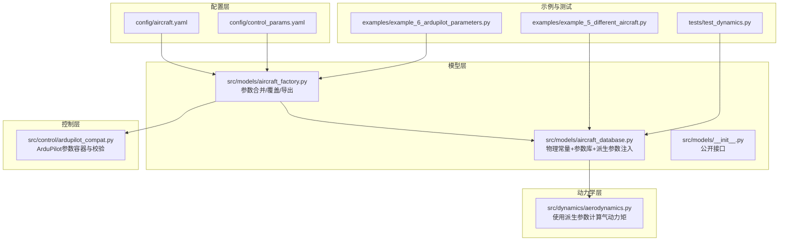
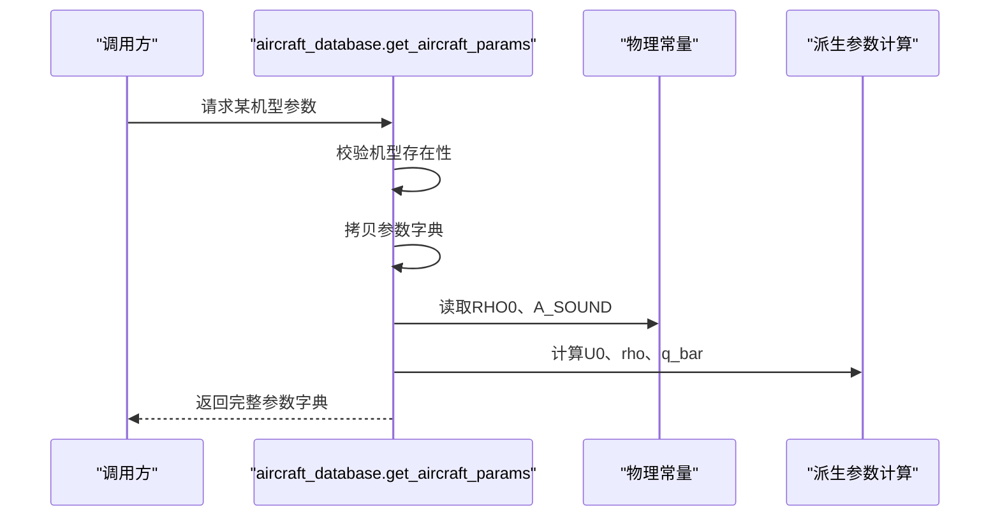
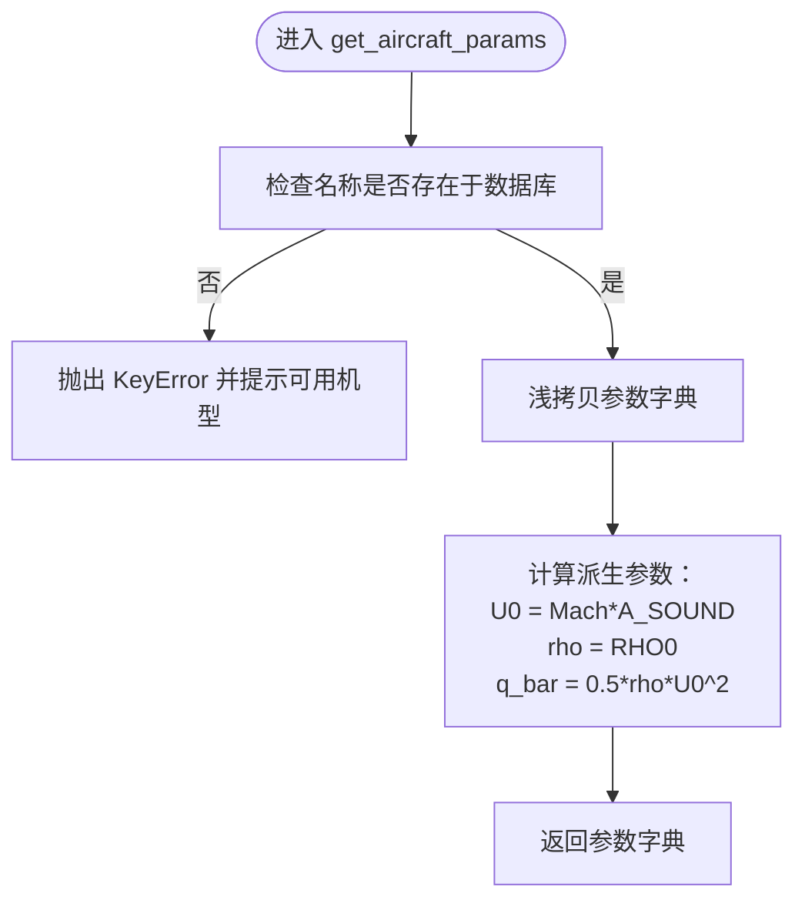
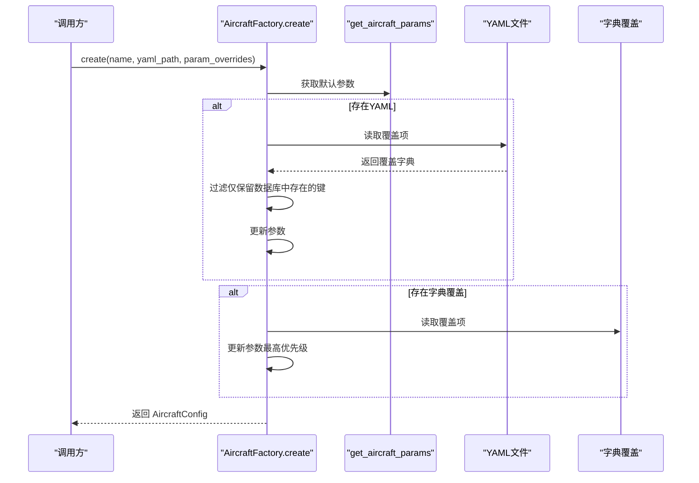
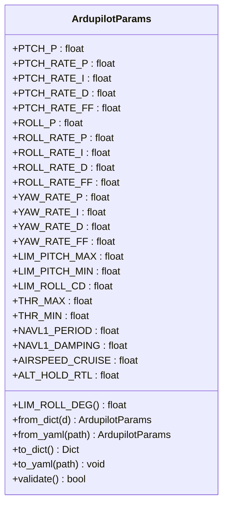
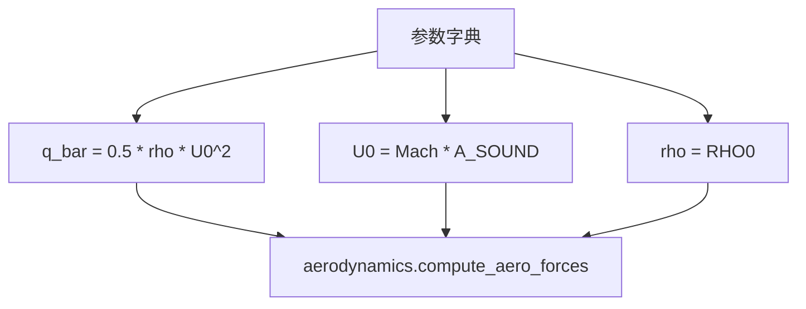
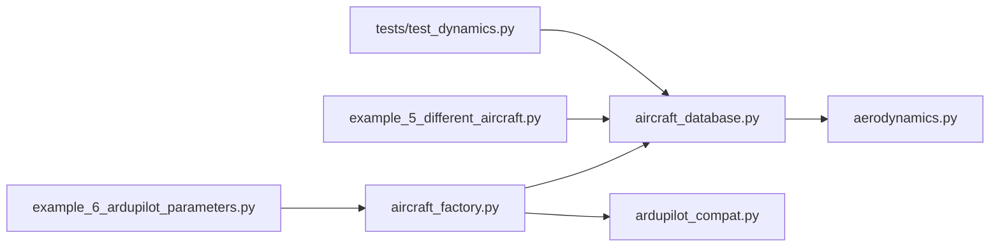

# 飞机参数数据库

<cite>
**本文引用的文件**
- [aircraft_database.py](file://src/models/aircraft_database.py)
- [aircraft_factory.py](file://src/models/aircraft_factory.py)
- [aircraft.yaml](file://config/aircraft.yaml)
- [control_params.yaml](file://config/control_params.yaml)
- [ardupilot_compat.py](file://src/control/ardupilot_compat.py)
- [aerodynamics.py](file://src/dynamics/aerodynamics.py)
- [example_5_different_aircraft.py](file://examples/example_5_different_aircraft.py)
- [example_6_ardupilot_parameters.py](file://examples/example_6_ardupilot_parameters.py)
- [test_dynamics.py](file://tests/test_dynamics.py)
</cite>

## 目录
1. [简介](#简介)
2. [项目结构](#项目结构)
3. [核心组件](#核心组件)
4. [架构总览](#架构总览)
5. [详细组件分析](#详细组件分析)
6. [依赖关系分析](#依赖关系分析)
7. [性能考虑](#性能考虑)
8. [故障排查指南](#故障排查指南)
9. [结论](#结论)
10. [附录](#附录)

## 简介
本文件系统化阐述飞机参数数据库的设计与实现，覆盖以下关键内容：
- 物理常量与派生参数的定义与计算（如标准重力加速度、海平面密度、声速、空速U0、空气密度rho、动压q_bar）
- 固定翼飞机参数格式与数据组织方式
- 支持的7种固定翼飞机型号（TB2、Anka、Aksungur、Karayel、Predator、Heron MK1、Heron MK2）及其参数含义
- 参数命名规范与TypedDict兼容性
- 如何扩展新的飞机型号
- 参数验证机制与错误处理策略
- 派生参数的计算逻辑与在动力学模块中的应用
- 查询与导出接口：如何获取完整参数字典、列出机型、生成ArduPilot兼容参数文件

## 项目结构
该数据库位于模型层，通过工厂模式与配置文件协同工作，为仿真引擎提供统一的参数来源，并支持运行时覆盖与ArduPilot参数导出。

图表来源
- [aircraft_database.py](file://src/models/aircraft_database.py#L1-L183)
- [aircraft_factory.py](file://src/models/aircraft_factory.py#L1-L136)
- [aircraft.yaml](file://config/aircraft.yaml#L1-L13)
- [control_params.yaml](file://config/control_params.yaml#L1-L45)
- [ardupilot_compat.py](file://src/control/ardupilot_compat.py#L1-L130)
- [aerodynamics.py](file://src/dynamics/aerodynamics.py#L90-L128)
- [example_5_different_aircraft.py](file://examples/example_5_different_aircraft.py#L1-L65)
- [example_6_ardupilot_parameters.py](file://examples/example_6_ardupilot_parameters.py#L1-L85)
- [test_dynamics.py](file://tests/test_dynamics.py#L1-L200)

章节来源
- [aircraft_database.py](file://src/models/aircraft_database.py#L1-L183)
- [aircraft_factory.py](file://src/models/aircraft_factory.py#L1-L136)
- [aircraft.yaml](file://config/aircraft.yaml#L1-L13)
- [control_params.yaml](file://config/control_params.yaml#L1-L45)
- [ardupilot_compat.py](file://src/control/ardupilot_compat.py#L1-L130)
- [aerodynamics.py](file://src/dynamics/aerodynamics.py#L90-L128)
- [example_5_different_aircraft.py](file://examples/example_5_different_aircraft.py#L1-L65)
- [example_6_ardupilot_parameters.py](file://examples/example_6_ardupilot_parameters.py#L1-L85)
- [test_dynamics.py](file://tests/test_dynamics.py#L1-L200)

## 核心组件
- 物理常量与派生参数
  - 标准重力加速度、海平面ISA密度、气体常数、绝热指数、声速
  - 派生参数：空速U0 = Mach × 声速；空气密度rho = 海平面密度；动压q_bar = 0.5 × rho × U0^2
- 主数据库
  - 7种固定翼飞机参数字典，包含几何/惯性、纵向/横向气动系数等
  - 提供公共访问函数：获取完整参数、列出机型、生成可读信息
- 工厂与配置
  - 合并数据库默认参数与用户覆盖（YAML或字典），导出ArduPilot兼容参数文件
- 参数容器与校验
  - ArduPilot参数容器，支持从YAML加载、保存、范围校验

章节来源
- [aircraft_database.py](file://src/models/aircraft_database.py#L14-L21)
- [aircraft_database.py](file://src/models/aircraft_database.py#L29-L133)
- [aircraft_database.py](file://src/models/aircraft_database.py#L143-L182)
- [aircraft_factory.py](file://src/models/aircraft_factory.py#L42-L74)
- [aircraft_factory.py](file://src/models/aircraft_factory.py#L95-L135)
- [ardupilot_compat.py](file://src/control/ardupilot_compat.py#L17-L129)

## 架构总览
数据库采用“常量+参数字典+派生参数注入”的三层设计：
- 常量层：物理/大气常量集中定义
- 数据层：7种机型参数字典，键名与历史TypedDict保持一致
- 访问层：公共接口负责参数拷贝、派生参数注入、错误处理与信息汇总

图表来源
- [aircraft_database.py](file://src/models/aircraft_database.py#L143-L166)

章节来源
- [aircraft_database.py](file://src/models/aircraft_database.py#L143-L166)

## 详细组件分析

### 组件A：飞机参数数据库（aircraft_database.py）
- 结构与职责
  - 定义物理常量与派生参数计算
  - 维护7种机型参数字典，键名与历史TypedDict完全一致
  - 提供公共接口：获取参数、列出机型、生成人类可读信息
- 关键函数
  - get_aircraft_params：参数拷贝、派生参数注入、异常抛出
  - list_aircraft：返回可用机型列表
  - aircraft_info：生成机型摘要字符串
- 错误处理
  - 未找到机型时抛出KeyError，包含可用机型提示
- 性能特性
  - 字典查找O(1)，派生参数计算O(1)，内存占用极低

图表来源
- [aircraft_database.py](file://src/models/aircraft_database.py#L143-L166)

章节来源
- [aircraft_database.py](file://src/models/aircraft_database.py#L14-L21)
- [aircraft_database.py](file://src/models/aircraft_database.py#L29-L133)
- [aircraft_database.py](file://src/models/aircraft_database.py#L143-L182)

### 组件B：飞机工厂（aircraft_factory.py）
- 结构与职责
  - 将数据库默认参数与用户覆盖合并，生成AircraftConfig
  - 支持从YAML配置文件加载覆盖项
  - 导出ArduPilot兼容参数文件（.param）
- 关键类与方法
  - AircraftConfig：封装名称与参数字典，提供摘要输出
  - AircraftFactory.create/from_yaml：合并覆盖、构建配置
  - export_ardupilot_params：导出MASS/WING_AREA/WING_SPAN/MEAN_CHORD/IYY/IXX/IZZ/AIRSPEED_CRUISE及控制参数
- 覆盖优先级
  - YAML覆盖（扁平或嵌套）→ 字典覆盖（最高优先级）

图表来源
- [aircraft_factory.py](file://src/models/aircraft_factory.py#L42-L74)

章节来源
- [aircraft_factory.py](file://src/models/aircraft_factory.py#L15-L37)
- [aircraft_factory.py](file://src/models/aircraft_factory.py#L42-L74)
- [aircraft_factory.py](file://src/models/aircraft_factory.py#L77-L92)
- [aircraft_factory.py](file://src/models/aircraft_factory.py#L95-L135)

### 组件C：ArduPilot参数容器与校验（ardupilot_compat.py）
- 结构与职责
  - 提供与ArduPilot命名一致的参数容器
  - 支持从YAML加载、保存、范围校验
- 关键功能
  - from_dict/from_yaml：从字典/YAML创建实例
  - to_dict/to_yaml：导出参数
  - validate：对关键参数进行范围检查并打印警告
- 使用场景
  - 示例中用于加载控制参数、调整PID增益、导出到ArduPilot .param文件

图表来源
- [ardupilot_compat.py](file://src/control/ardupilot_compat.py#L17-L129)

章节来源
- [ardupilot_compat.py](file://src/control/ardupilot_compat.py#L17-L129)

### 组件D：参数命名规范与TypedDict兼容性
- 命名规范
  - 机型参数键名与历史TypedDict保持一致，确保无缝替换
  - 横向气动系数前缀：CY_、Cl_、Cn_
  - 纵向气动系数前缀：CL_、CD_、Cm_
  - 角速度相关系数：带下标q、p、r
  - 副翼/方向舵偏角：da、dr
- 扩展新机型
  - 在数据库字典中新增键值对，遵循现有命名与单位
  - 若新增参数，需在派生参数注入处同步处理，或在工厂层提供覆盖入口

章节来源
- [aircraft_database.py](file://src/models/aircraft_database.py#L29-L133)

### 组件E：派生参数计算与在动力学中的应用
- 派生参数
  - U0 = Mach × 声速
  - rho = 海平面密度
  - q_bar = 0.5 × rho × U0^2
- 动力学模块使用
  - 气动计算模块直接使用q_bar作为动态压力输入
  - 单元测试验证了q_bar在不同风速下的正确性与稳定性

图表来源
- [aircraft_database.py](file://src/models/aircraft_database.py#L159-L164)
- [aerodynamics.py](file://src/dynamics/aerodynamics.py#L90-L128)

章节来源
- [aircraft_database.py](file://src/models/aircraft_database.py#L159-L164)
- [aerodynamics.py](file://src/dynamics/aerodynamics.py#L90-L128)
- [test_dynamics.py](file://tests/test_dynamics.py#L190-L195)

### 组件F：查询与导出接口
- 查询接口
  - 列出所有机型：list_aircraft()
  - 获取完整参数：get_aircraft_params(name)
  - 生成人类可读信息：aircraft_info(name)
- 导出接口
  - 导出ArduPilot参数文件：export_ardupilot_params(name, output_path, control_yaml)
  - 支持同时合并控制参数（如PID增益）

章节来源
- [aircraft_database.py](file://src/models/aircraft_database.py#L169-L182)
- [aircraft_factory.py](file://src/models/aircraft_factory.py#L95-L135)

## 依赖关系分析
- 模块耦合
  - aircraft_database.py 仅依赖typing与math，内聚性强
  - aircraft_factory.py 依赖yaml、os、dataclasses与aircraft_database
  - aerodynamics.py 依赖数据库参数字典中的系数键
- 外部依赖
  - YAML解析（PyYAML）
  - NumPy（示例与测试中使用）
- 循环依赖
  - 无循环导入，层次清晰

图表来源
- [aircraft_database.py](file://src/models/aircraft_database.py#L1-L183)
- [aircraft_factory.py](file://src/models/aircraft_factory.py#L1-L136)
- [aerodynamics.py](file://src/dynamics/aerodynamics.py#L90-L128)
- [ardupilot_compat.py](file://src/control/ardupilot_compat.py#L1-L130)
- [example_5_different_aircraft.py](file://examples/example_5_different_aircraft.py#L1-L65)
- [example_6_ardupilot_parameters.py](file://examples/example_6_ardupilot_parameters.py#L1-L85)
- [test_dynamics.py](file://tests/test_dynamics.py#L1-L200)

章节来源
- [aircraft_database.py](file://src/models/aircraft_database.py#L1-L183)
- [aircraft_factory.py](file://src/models/aircraft_factory.py#L1-L136)
- [aerodynamics.py](file://src/dynamics/aerodynamics.py#L90-L128)
- [ardupilot_compat.py](file://src/control/ardupilot_compat.py#L1-L130)
- [example_5_different_aircraft.py](file://examples/example_5_different_aircraft.py#L1-L65)
- [example_6_ardupilot_parameters.py](file://examples/example_6_ardupilot_parameters.py#L1-L85)
- [test_dynamics.py](file://tests/test_dynamics.py#L1-L200)

## 性能考虑
- 数据结构
  - 参数字典为常量访问，O(1)查找
  - 派生参数计算为纯数学运算，O(1)
- 内存
  - 参数字典按需拷贝，浅拷贝避免深拷贝开销
- I/O
  - YAML读写在工厂层触发，建议缓存常用配置
- 数值稳定性
  - 动力学模块对极低空速有动态压力保护，避免数值不稳定

[本节为通用指导，无需特定文件来源]

## 故障排查指南
- 未找到机型
  - 现象：KeyError，提示可用机型
  - 排查：确认名称大小写与可用列表一致
  - 参考：[aircraft_database.py](file://src/models/aircraft_database.py#L153-L156)
- 参数越界
  - 现象：ArduPilot参数校验打印警告
  - 排查：检查控制参数范围，参考校验规则
  - 参考：[ardupilot_compat.py](file://src/control/ardupilot_compat.py#L110-L129)
- YAML路径错误
  - 现象：FileNotFoundError
  - 排查：确认配置文件路径存在且可读
  - 参考：[aircraft_factory.py](file://src/models/aircraft_factory.py#L84-L88)
- 导出文件权限
  - 现象：无法写入目标目录
  - 排查：确认输出路径存在且具备写权限
  - 参考：[aircraft_factory.py](file://src/models/aircraft_factory.py#L129-L133)

章节来源
- [aircraft_database.py](file://src/models/aircraft_database.py#L153-L156)
- [ardupilot_compat.py](file://src/control/ardupilot_compat.py#L110-L129)
- [aircraft_factory.py](file://src/models/aircraft_factory.py#L84-L88)
- [aircraft_factory.py](file://src/models/aircraft_factory.py#L129-L133)

## 结论
该飞机参数数据库以简洁的常量+字典+派生参数注入为核心，实现了与历史TypedDict的完全兼容，支持7种固定翼机型参数的统一管理与扩展。通过工厂层的参数合并与ArduPilot参数导出能力，系统既满足仿真引擎的高性能需求，又便于工程化落地与参数调优。建议在扩展新机型时严格遵循命名规范，并在派生参数与校验逻辑中同步更新。

[本节为总结性内容，无需特定文件来源]

## 附录

### A. 支持的7种固定翼飞机型号与参数含义
- TB2、Anka、Aksungur、Karayel、Predator、Heron MK1、Heron MK2
- 参数类别
  - 识别信息：name、company、country
  - 几何/惯性：mass、S（机翼面积）、c（平均弦长）、b（翼展）、Ixx、Iyy、Izz、Ixz
  - 气动特性：纵向（CL_0、CL_alpha、CL_q、CL_deltae、CD_0、CD_alpha、CD_q、CD_deltae、Cm_0、Cm_alpha、Cm_q、Cm_deltae）、横向（CYb、CYp、CYr、CYda、CYdr；Clb、Clp、Clr、Clda、Cldr；Cnb、Cnp、Cnr、Cnda、Cndr）
  - 飞行状态：Mach（马赫数）

章节来源
- [aircraft_database.py](file://src/models/aircraft_database.py#L29-L133)
- [aircraft.yaml](file://config/aircraft.yaml#L3)

### B. 参数命名规范与TypedDict结构
- 命名规范
  - 系数前缀：纵向（CL_/CD_/Cm_）、横向（CY_/Cl_/Cn_）
  - 角速度相关：下标q（俯仰）、p（滚转）、r（偏航）
  - 控制面偏角：de（升降舵）、da（副翼）、dr（方向舵）
- TypedDict兼容
  - 键名与历史类型定义保持一致，确保替换透明

章节来源
- [aircraft_database.py](file://src/models/aircraft_database.py#L25-L26)

### C. 扩展新飞机型号的步骤
- 在数据库字典中添加新键值对，遵循现有命名与单位
- 若涉及新增派生参数，需在派生参数注入处同步处理
- 使用工厂层的覆盖机制进行验证与导出

章节来源
- [aircraft_database.py](file://src/models/aircraft_database.py#L159-L164)
- [aircraft_factory.py](file://src/models/aircraft_factory.py#L42-L74)

### D. 参数验证机制与错误处理策略
- 数据库层
  - 未找到机型：抛出KeyError并提示可用机型
- 控制层
  - ArduPilot参数范围校验：逐项检查并打印警告
- 工厂层
  - YAML文件存在性检查：不存在时报错
  - 参数覆盖过滤：仅保留数据库中存在的键

章节来源
- [aircraft_database.py](file://src/models/aircraft_database.py#L153-L156)
- [ardupilot_compat.py](file://src/control/ardupilot_compat.py#L110-L129)
- [aircraft_factory.py](file://src/models/aircraft_factory.py#L64-L72)
- [aircraft_factory.py](file://src/models/aircraft_factory.py#L84-L88)

### E. 派生参数的计算逻辑
- U0 = Mach × 声速
- rho = 海平面密度
- q_bar = 0.5 × rho × U0^2
- 动力学模块直接使用q_bar进行气动计算

章节来源
- [aircraft_database.py](file://src/models/aircraft_database.py#L159-L164)
- [aerodynamics.py](file://src/dynamics/aerodynamics.py#L90-L128)

### F. 查询与导出接口使用示例
- 查询
  - 列出机型：list_aircraft()
  - 获取参数：get_aircraft_params(name)
  - 生成信息：aircraft_info(name)
- 导出
  - 导出ArduPilot参数：export_ardupilot_params(name, output_path, control_yaml)

章节来源
- [aircraft_database.py](file://src/models/aircraft_database.py#L169-L182)
- [aircraft_factory.py](file://src/models/aircraft_factory.py#L95-L135)