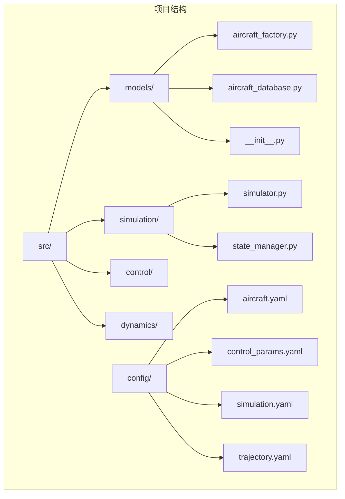
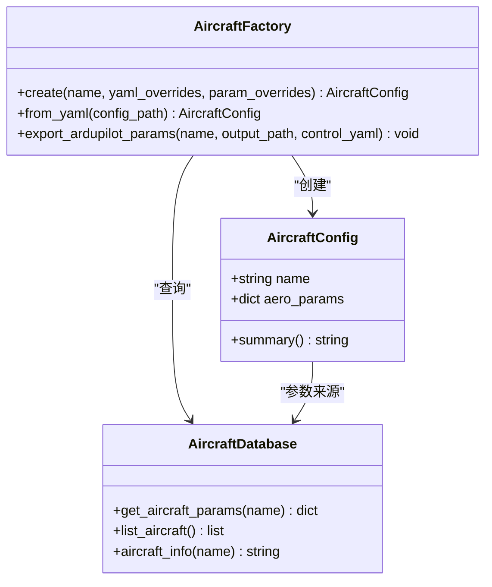
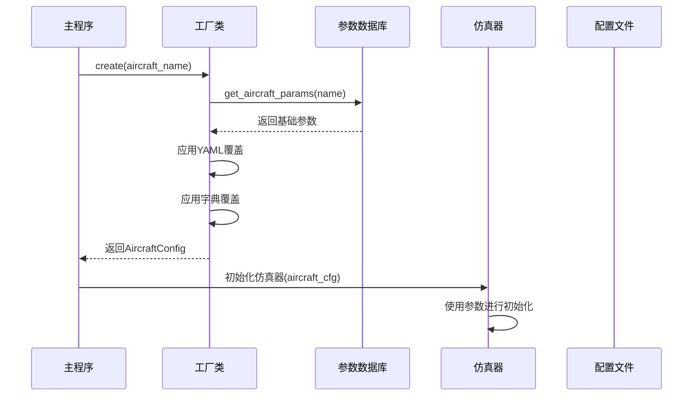
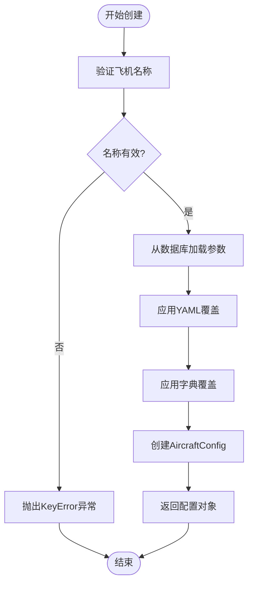
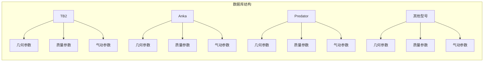
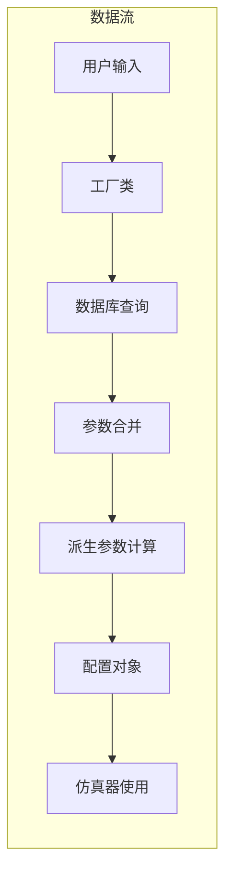
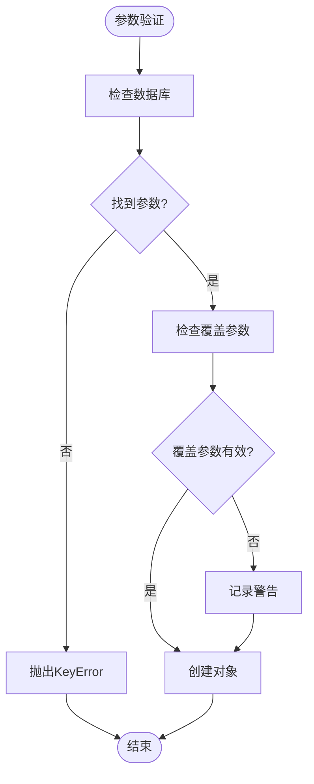
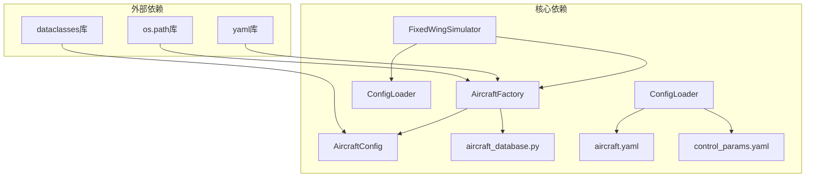

# 飞机工厂模式

<cite>
**本文档引用的文件**
- [aircraft_factory.py](file://src/models/aircraft_factory.py)
- [aircraft_database.py](file://src/models/aircraft_database.py)
- [__init__.py](file://src/models/__init__.py)
- [aircraft.yaml](file://config/aircraft.yaml)
- [simulator.py](file://src/simulation/simulator.py)
- [example_6_ardupilot_parameters.py](file://examples/example_6_ardupilot_parameters.py)
- [main.py](file://main.py)
- [example_5_different_aircraft.py](file://examples/example_5_different_aircraft.py)
</cite>

## 目录
1. [简介](#简介)
2. [项目结构](#项目结构)
3. [核心组件](#核心组件)
4. [架构概览](#架构概览)
5. [详细组件分析](#详细组件分析)
6. [依赖关系分析](#依赖关系分析)
7. [性能考虑](#性能考虑)
8. [故障排除指南](#故障排除指南)
9. [结论](#结论)
10. [附录](#附录)

## 简介

本文件详细阐述了固定翼飞行器模拟器中飞机工厂模式的设计与实现。工厂模式作为一种创建型设计模式，在本项目中被巧妙地应用于飞机配置管理，实现了对不同型号飞机参数的统一管理和动态创建。

该工厂模式的核心价值在于：
- **统一接口**：为所有飞机类型提供一致的访问和操作接口
- **易于扩展**：新增飞机型号时无需修改现有代码
- **参数验证**：内置参数校验和错误处理机制
- **配置管理**：支持从多种来源加载和合并配置参数
- **数据库集成**：与内部参数数据库无缝对接

## 项目结构

项目采用模块化的分层架构，飞机工厂模式位于模型层（models），与仿真核心、控制系统等其他模块保持松耦合关系。



**图表来源**
- [aircraft_factory.py](file://src/models/aircraft_factory.py#L1-L136)
- [aircraft_database.py](file://src/models/aircraft_database.py#L1-L183)
- [__init__.py](file://src/models/__init__.py#L1-L15)

**章节来源**
- [aircraft_factory.py](file://src/models/aircraft_factory.py#L1-L136)
- [aircraft_database.py](file://src/models/aircraft_database.py#L1-L183)
- [__init__.py](file://src/models/__init__.py#L1-L15)

## 核心组件

### 工厂类架构

飞机工厂模式的核心由两个主要组件构成：

#### AircraftConfig 数据类
负责封装飞机配置信息，提供统一的数据结构和摘要功能。

#### AircraftFactory 工厂类
提供静态方法来创建和管理飞机配置实例。



**图表来源**
- [aircraft_factory.py](file://src/models/aircraft_factory.py#L15-L136)
- [aircraft_database.py](file://src/models/aircraft_database.py#L143-L183)

**章节来源**
- [aircraft_factory.py](file://src/models/aircraft_factory.py#L15-L136)
- [aircraft_database.py](file://src/models/aircraft_database.py#L143-L183)

## 架构概览

飞机工厂模式在整个系统中的位置和交互关系如下：



**图表来源**
- [main.py](file://main.py#L98-L122)
- [simulator.py](file://src/simulation/simulator.py#L155-L157)
- [aircraft_factory.py](file://src/models/aircraft_factory.py#L42-L74)

## 详细组件分析

### 工厂类设计架构

#### 参数验证机制

工厂类实现了多层次的参数验证和错误处理：



**图表来源**
- [aircraft_factory.py](file://src/models/aircraft_factory.py#L42-L74)
- [aircraft_database.py](file://src/models/aircraft_database.py#L143-L166)

#### 实例化过程

工厂类的实例化过程具有以下特点：

1. **参数加载**：从内部数据库获取基础参数
2. **YAML覆盖**：支持从外部配置文件加载覆盖参数
3. **字典覆盖**：支持运行时动态参数覆盖
4. **参数注入**：自动计算派生参数（如速度、密度等）

**章节来源**
- [aircraft_factory.py](file://src/models/aircraft_factory.py#L42-L74)
- [aircraft_database.py](file://src/models/aircraft_database.py#L159-L166)

### 数据库集成方式

#### 内部参数数据库

项目内置了完整的飞机参数数据库，包含7种不同型号的固定翼无人机参数：



**图表来源**
- [aircraft_database.py](file://src/models/aircraft_database.py#L29-L133)

#### 数据流转过程



**图表来源**
- [aircraft_factory.py](file://src/models/aircraft_factory.py#L61-L74)
- [aircraft_database.py](file://src/models/aircraft_database.py#L159-L166)

**章节来源**
- [aircraft_database.py](file://src/models/aircraft_database.py#L1-L183)

### 错误处理机制

工厂模式实现了完善的错误处理策略：

#### 异常类型
- **KeyError**：当请求不存在的飞机型号时抛出
- **ValueError**：当仿真器接收到未知飞机型号时抛出

#### 错误处理流程



**图表来源**
- [aircraft_database.py](file://src/models/aircraft_database.py#L143-L166)
- [simulator.py](file://src/simulation/simulator.py#L140-L141)

**章节来源**
- [aircraft_database.py](file://src/models/aircraft_database.py#L143-L166)
- [simulator.py](file://src/simulation/simulator.py#L140-L141)

### 自定义飞机实例创建

#### 方法一：直接工厂调用

```python
# 基础创建
config = AircraftFactory.create("TB2")

# 带YAML覆盖
config = AircraftFactory.create("TB2", yaml_overrides="path/to/config.yaml")

# 带字典覆盖
overrides = {"mass": 750.0, "S": 9.5}
config = AircraftFactory.create("TB2", param_overrides=overrides)
```

#### 方法二：从配置文件创建

```python
# 从YAML配置文件创建
config = AircraftFactory.from_yaml("config/aircraft.yaml")
```

#### 方法三：ArduPilot参数导出

```python
# 导出到ArduPilot兼容格式
AircraftFactory.export_ardupilot_params(
    "TB2", 
    "output/TB2.param", 
    "config/control_params.yaml"
)
```

**章节来源**
- [aircraft_factory.py](file://src/models/aircraft_factory.py#L42-L136)

## 依赖关系分析

### 组件耦合度分析



**图表来源**
- [aircraft_factory.py](file://src/models/aircraft_factory.py#L1-L136)
- [simulator.py](file://src/simulation/simulator.py#L1-L319)

### 外部依赖管理

工厂模式对外部依赖的管理体现了良好的设计原则：

1. **最小依赖原则**：仅依赖必要的标准库和第三方库
2. **版本兼容性**：使用Python 3.6+特性确保广泛兼容性
3. **类型注解**：完整的类型提示支持IDE智能感知

**章节来源**
- [aircraft_factory.py](file://src/models/aircraft_factory.py#L5-L12)

## 性能考虑

### 时间复杂度分析

- **参数查询**：O(1) - 字典查找
- **参数合并**：O(n) - n为覆盖参数数量
- **派生参数计算**：O(1) - 固定数学运算

### 空间复杂度分析

- **内存占用**：每个AircraftConfig约占用几百字节
- **缓存策略**：数据库参数按需加载，避免不必要的内存占用

### 优化建议

1. **延迟加载**：对于大型参数集可考虑延迟计算派生参数
2. **参数复用**：相同配置的实例可考虑缓存机制
3. **批量处理**：多飞机同时仿真时可优化参数加载策略

## 故障排除指南

### 常见问题及解决方案

#### 问题1：飞机型号不存在
**症状**：KeyError异常
**原因**：请求的飞机型号不在数据库中
**解决**：检查飞机名称拼写或添加新飞机型号

#### 问题2：配置文件路径错误
**症状**：文件不存在或无法读取
**解决**：确认配置文件路径正确且有读权限

#### 问题3：参数覆盖冲突
**症状**：参数值不符合预期
**解决**：检查覆盖优先级和参数有效性

### 调试技巧

1. **参数验证**：使用`aircraft_info()`函数检查参数完整性
2. **配置检查**：打印`AircraftConfig.summary()`查看最终参数
3. **数据库查询**：直接调用`get_aircraft_params()`验证数据源

**章节来源**
- [aircraft_database.py](file://src/models/aircraft_database.py#L174-L182)
- [aircraft_factory.py](file://src/models/aircraft_factory.py#L28-L36)

## 结论

飞机工厂模式在固定翼飞行器模拟器中的成功应用体现了以下设计优势：

1. **高度模块化**：工厂模式与仿真核心完全解耦
2. **强扩展性**：新增飞机型号只需更新数据库
3. **灵活配置**：支持多层级参数覆盖和定制
4. **健壮性**：完善的错误处理和参数验证机制
5. **易用性**：简洁的API设计降低使用门槛

该模式不仅满足了当前项目的需要，也为未来的功能扩展奠定了坚实基础。通过工厂模式，开发者可以专注于飞机特性的实现，而无需关心复杂的参数管理和实例化过程。

## 附录

### 最佳实践指南

#### 创建自定义飞机实例的推荐流程

1. **确定需求**：明确飞机的基本参数和特殊要求
2. **选择基线**：选择最接近的现有飞机型号作为基线
3. **应用覆盖**：使用YAML文件进行参数覆盖
4. **验证配置**：通过`aircraft_info()`和`summary()`验证参数
5. **测试运行**：在简单场景下验证飞机行为

#### 配置文件格式参考

```yaml
# 基础配置
aircraft_name: TB2

# 可选覆盖参数
overrides:
  mass: 700.0
  S: 9.34
  c: 0.78
  b: 12.0
```

#### 实际应用场景

1. **多机型对比研究**：快速切换不同飞机型号进行性能比较
2. **参数敏感性分析**：系统性地调整参数观察性能变化
3. **控制算法验证**：在不同飞机上测试相同的控制策略
4. **飞行器设计优化**：迭代改进飞机设计参数

**章节来源**
- [aircraft.yaml](file://config/aircraft.yaml#L1-L13)
- [example_5_different_aircraft.py](file://examples/example_5_different_aircraft.py#L1-L65)