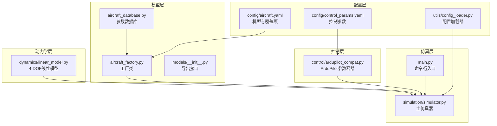
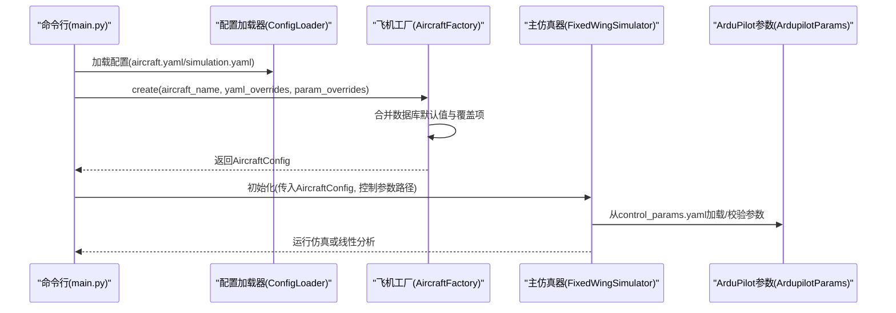
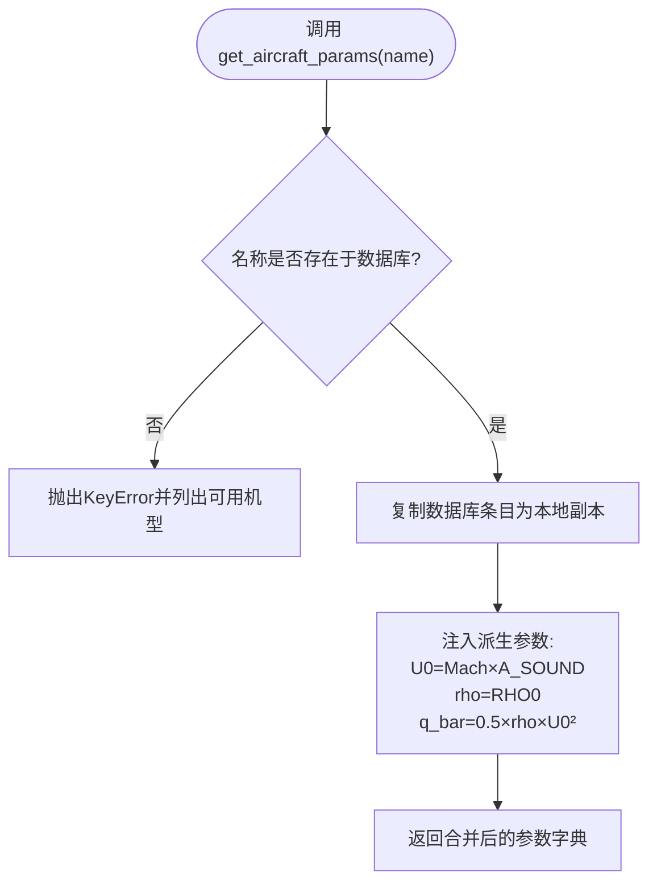
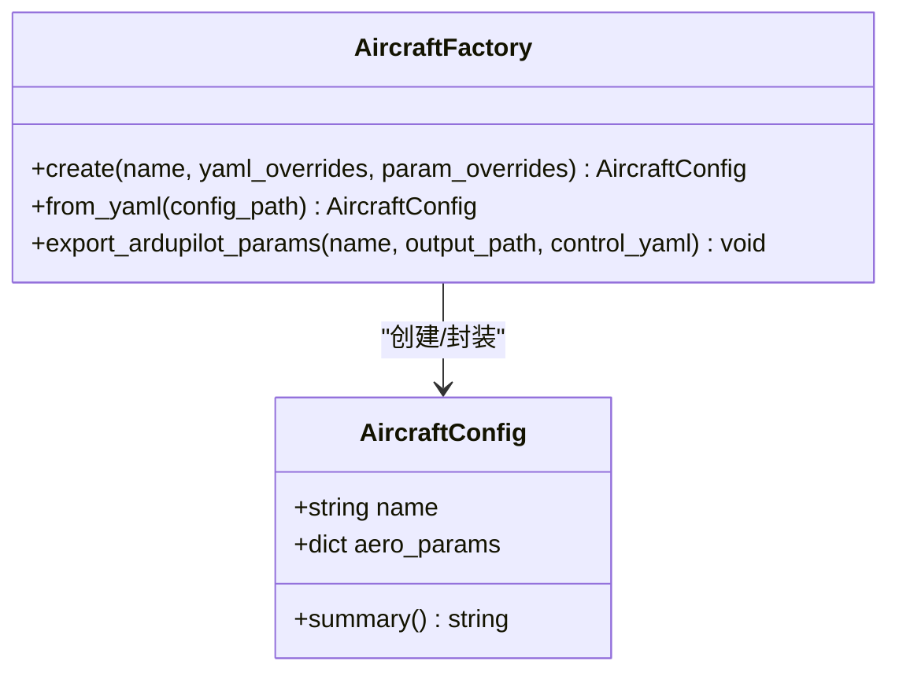
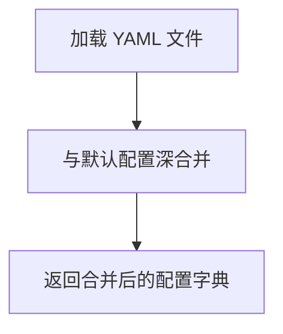
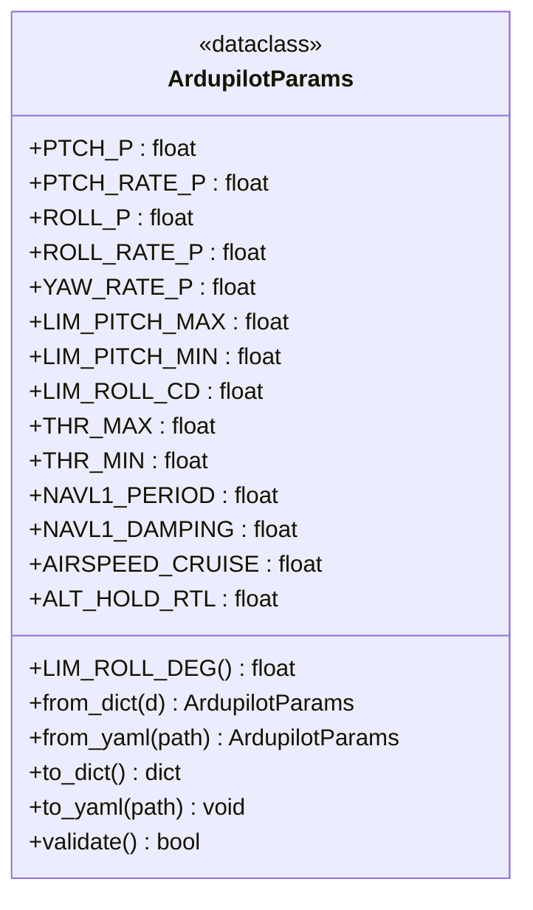
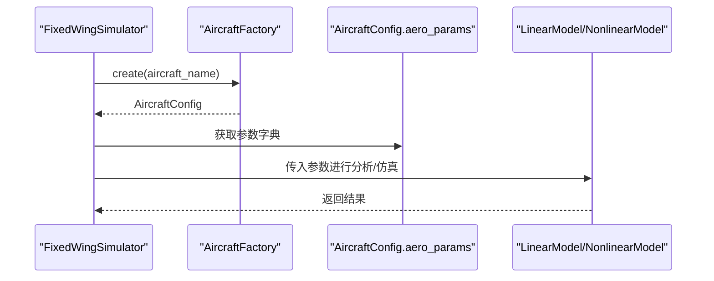
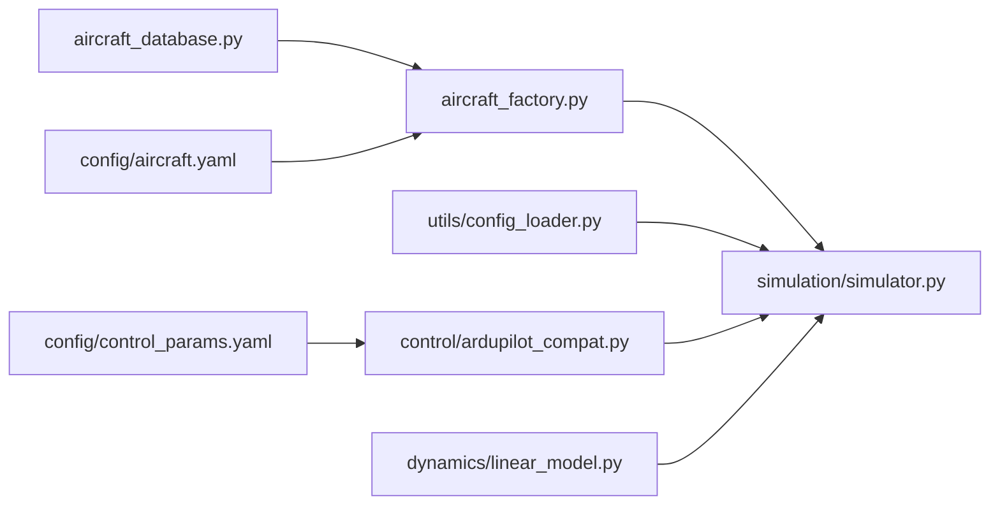

# 飞机模型系统

<cite>
**本文引用的文件**
- [src/models/aircraft_database.py](file://src/models/aircraft_database.py)
- [src/models/aircraft_factory.py](file://src/models/aircraft_factory.py)
- [src/models/__init__.py](file://src/models/__init__.py)
- [config/aircraft.yaml](file://config/aircraft.yaml)
- [config/control_params.yaml](file://config/control_params.yaml)
- [src/utils/config_loader.py](file://src/utils/config_loader.py)
- [examples/example_5_different_aircraft.py](file://examples/example_5_different_aircraft.py)
- [examples/example_6_ardupilot_parameters.py](file://examples/example_6_ardupilot_parameters.py)
- [src/simulation/simulator.py](file://src/simulation/simulator.py)
- [src/dynamics/linear_model.py](file://src/dynamics/linear_model.py)
- [src/control/ardupilot_compat.py](file://src/control/ardupilot_compat.py)
- [main.py](file://main.py)
</cite>

## 目录
1. [简介](#简介)
2. [项目结构](#项目结构)
3. [核心组件](#核心组件)
4. [架构总览](#架构总览)
5. [详细组件分析](#详细组件分析)
6. [依赖关系分析](#依赖关系分析)
7. [性能考量](#性能考量)
8. [故障排查指南](#故障排查指南)
9. [结论](#结论)
10. [附录](#附录)

## 简介
本文件为“飞机模型系统”的完整技术文档，聚焦于飞机参数数据库与工厂模式的实现、参数验证与默认值处理、ArduPilot 兼容导出、以及与动力学系统的集成方式。系统支持多种固定翼无人机模型，提供从配置文件到仿真运行的端到端流程，并允许通过 YAML 覆盖参数以实现灵活的定制。

## 项目结构
项目采用按功能域划分的层次化组织：模型层（参数数据库与工厂）、工具层（配置加载）、控制层（ArduPilot 兼容参数）、动力学层（线性/非线性模型）、仿真层（主仿真器）等。配置文件位于 config 目录，示例脚本位于 examples 目录，输出结果保存在 output 目录。

图表来源
- [src/models/aircraft_database.py](file://src/models/aircraft_database.py#L1-L183)
- [src/models/aircraft_factory.py](file://src/models/aircraft_factory.py#L1-L136)
- [src/models/__init__.py](file://src/models/__init__.py#L1-L15)
- [config/aircraft.yaml](file://config/aircraft.yaml#L1-L13)
- [config/control_params.yaml](file://config/control_params.yaml#L1-L45)
- [src/utils/config_loader.py](file://src/utils/config_loader.py#L1-L82)
- [src/simulation/simulator.py](file://src/simulation/simulator.py#L1-L200)
- [src/dynamics/linear_model.py](file://src/dynamics/linear_model.py#L1-L200)
- [src/control/ardupilot_compat.py](file://src/control/ardupilot_compat.py#L1-L130)
- [main.py](file://main.py#L1-L145)

章节来源
- [src/models/aircraft_database.py](file://src/models/aircraft_database.py#L1-L183)
- [src/models/aircraft_factory.py](file://src/models/aircraft_factory.py#L1-L136)
- [src/models/__init__.py](file://src/models/__init__.py#L1-L15)
- [config/aircraft.yaml](file://config/aircraft.yaml#L1-L13)
- [config/control_params.yaml](file://config/control_params.yaml#L1-L45)
- [src/utils/config_loader.py](file://src/utils/config_loader.py#L1-L82)
- [src/simulation/simulator.py](file://src/simulation/simulator.py#L1-L200)
- [src/dynamics/linear_model.py](file://src/dynamics/linear_model.py#L1-L200)
- [src/control/ardupilot_compat.py](file://src/control/ardupilot_compat.py#L1-L130)
- [main.py](file://main.py#L1-L145)

## 核心组件
- 飞机参数数据库：集中存储多型固定翼无人机的几何、质量、惯性、气动导数等参数，并注入派生参数（如静压、空速、参考动压）。
- 飞机工厂：从数据库读取参数，支持 YAML 覆盖与字典覆盖，生成统一的 AircraftConfig；可导出 ArduPilot .param 文件。
- 配置加载器：合并默认配置与用户 YAML，提供分模块加载能力。
- ArduPilot 参数容器：提供与 ArduPilot 命名一致的数据类，支持从 YAML 加载、导出与基本范围校验。
- 主仿真器：整合模型、环境、控制、规划与可视化模块，支持开环/闭环仿真与线性分析。
- 线性模型：4-DOF 纵向线性状态空间模型，用于模态分析与短期响应比较。

章节来源
- [src/models/aircraft_database.py](file://src/models/aircraft_database.py#L143-L166)
- [src/models/aircraft_factory.py](file://src/models/aircraft_factory.py#L42-L74)
- [src/utils/config_loader.py](file://src/utils/config_loader.py#L59-L82)
- [src/control/ardupilot_compat.py](file://src/control/ardupilot_compat.py#L17-L129)
- [src/simulation/simulator.py](file://src/simulation/simulator.py#L115-L200)
- [src/dynamics/linear_model.py](file://src/dynamics/linear_model.py#L107-L200)

## 架构总览
系统采用“配置驱动 + 工厂模式 + 统一参数容器”的架构。配置文件决定机型与参数覆盖，工厂负责参数合并与导出，仿真器统一调度各子系统。

图表来源
- [main.py](file://main.py#L98-L141)
- [src/utils/config_loader.py](file://src/utils/config_loader.py#L68-L81)
- [src/models/aircraft_factory.py](file://src/models/aircraft_factory.py#L42-L92)
- [src/simulation/simulator.py](file://src/simulation/simulator.py#L130-L171)
- [src/control/ardupilot_compat.py](file://src/control/ardupilot_compat.py#L82-L98)

## 详细组件分析

### 飞机参数数据库（aircraft_database.py）
- 设计要点
  - 内置多型固定翼无人机参数，字段命名与历史数据结构保持兼容。
  - 提供派生参数注入：基于马赫数计算空速、密度与动压，供动力学模块直接使用。
  - 提供查询接口与列表/信息展示接口，便于调试与可视化。
- 支持的飞机类型与参数格式
  - 类型：TB2、Anka、Aksungur、Karayel、Predator、Heron MK1、Heron MK2。
  - 关键参数：质量、机翼面积、平均气动弦长、翼展、转动惯量、气动导数（纵向/横向/方向），以及 Mach 数。
- 默认值与派生参数
  - 大气常数与声速在模块内定义，派生参数在访问时注入，避免重复计算。
- 错误处理
  - 未找到机型时抛出异常，提示可用机型列表。

图表来源
- [src/models/aircraft_database.py](file://src/models/aircraft_database.py#L143-L166)

章节来源
- [src/models/aircraft_database.py](file://src/models/aircraft_database.py#L29-L133)
- [src/models/aircraft_database.py](file://src/models/aircraft_database.py#L143-L182)

### 飞机工厂（aircraft_factory.py）
- 工厂模式应用
  - create：从数据库读取参数，按顺序应用 YAML 覆盖与字典覆盖，最终封装为 AircraftConfig。
  - from_yaml：从 config/aircraft.yaml 读取机型与覆盖项，委托 create 完成合并。
  - export_ardupilot_params：将机型物理参数与控制参数导出为 ArduPilot .param 文件，便于地面站/固件使用。
- 参数覆盖优先级
  - 数据库默认值 ← YAML 覆盖（扁平或嵌套结构） ← 字典覆盖（最高优先级）。
- 输出对象
  - AircraftConfig 包含 name 与 aero_params，提供摘要方法用于快速查看关键参数。

图表来源
- [src/models/aircraft_factory.py](file://src/models/aircraft_factory.py#L15-L37)
- [src/models/aircraft_factory.py](file://src/models/aircraft_factory.py#L39-L136)

章节来源
- [src/models/aircraft_factory.py](file://src/models/aircraft_factory.py#L42-L92)
- [src/models/aircraft_factory.py](file://src/models/aircraft_factory.py#L94-L136)

### 配置加载器（config_loader.py）
- 功能
  - 提供默认配置模板，支持递归深合并用户 YAML，确保未指定项保留默认值。
  - 分模块加载：aircraft、simulation、trajectory、control。
- 使用方式
  - 在主程序中通过 ConfigLoader 实例加载所需配置，再交由工厂与仿真器使用。

图表来源
- [src/utils/config_loader.py](file://src/utils/config_loader.py#L40-L56)
- [src/utils/config_loader.py](file://src/utils/config_loader.py#L59-L82)

章节来源
- [src/utils/config_loader.py](file://src/utils/config_loader.py#L10-L82)

### ArduPilot 参数容器（ardupilot_compat.py）
- 设计
  - 使用 dataclass 定义与 ArduPilot 命名一致的控制参数集合，包含姿态/速率回路参数、限幅、导航与 TECS 相关参数。
  - 提供 from_dict/from_yaml/to_dict/to_yaml 等工厂与序列化方法。
  - validate 执行基本范围检查，打印越界警告并返回布尔结果。
- 默认值
  - 为中等规模固定翼无人机提供保守起始点，默认值适合 TB2 级别平台。
- 与工厂导出的关系
  - 工厂导出 .param 文件时会合并控制参数，便于直接导入 ArduPilot 地面站。

图表来源
- [src/control/ardupilot_compat.py](file://src/control/ardupilot_compat.py#L17-L129)

章节来源
- [src/control/ardupilot_compat.py](file://src/control/ardupilot_compat.py#L17-L129)

### 主仿真器（simulation/simulator.py）
- 角色
  - 协调模型、环境、控制、规划与可视化模块；支持闭环仿真、开环分析与线性分析。
- 关键流程
  - 初始化阶段：加载配置、创建 AircraftConfig、构建风场、加载 ArduPilot 参数并校验、初始化飞行模式管理与控制器。
  - 运行阶段：根据参数选择闭环/开环/线性分析路径。
- 与模型层集成
  - 通过 AircraftConfig 的 aero_params 传递给动力学模块；线性分析由 LinearModel 使用。

图表来源
- [src/simulation/simulator.py](file://src/simulation/simulator.py#L130-L171)
- [src/dynamics/linear_model.py](file://src/dynamics/linear_model.py#L114-L200)

章节来源
- [src/simulation/simulator.py](file://src/simulation/simulator.py#L115-L200)
- [src/dynamics/linear_model.py](file://src/dynamics/linear_model.py#L107-L200)

### 示例与使用
- 多机型对比（example_5_different_aircraft.py）
  - 展示数据库中全部机型在相同扰动下的线性响应与模态比较。
- ArduPilot 参数敏感性（example_6_ardupilot_parameters.py）
  - 演示从 YAML 加载参数、校验、导出 .param 文件，以及热更新增益后跟踪性能对比。

章节来源
- [examples/example_5_different_aircraft.py](file://examples/example_5_different_aircraft.py#L1-L65)
- [examples/example_6_ardupilot_parameters.py](file://examples/example_6_ardupilot_parameters.py#L1-L85)

## 依赖关系分析
- 模块耦合
  - models 层（数据库/工厂）被 simulation 层广泛依赖；control 层参数通过工厂导出与仿真器加载形成闭环。
  - utils 层提供配置加载能力，降低上层对配置细节的感知。
- 外部依赖
  - YAML 解析、NumPy、SciPy、Matplotlib（可视化）等。
- 循环依赖
  - 未发现循环导入；工厂与数据库通过函数接口交互，避免强耦合。

图表来源
- [src/models/aircraft_database.py](file://src/models/aircraft_database.py#L1-L183)
- [src/models/aircraft_factory.py](file://src/models/aircraft_factory.py#L1-L136)
- [src/utils/config_loader.py](file://src/utils/config_loader.py#L1-L82)
- [src/simulation/simulator.py](file://src/simulation/simulator.py#L1-L200)
- [src/dynamics/linear_model.py](file://src/dynamics/linear_model.py#L1-L200)
- [src/control/ardupilot_compat.py](file://src/control/ardupilot_compat.py#L1-L130)
- [config/aircraft.yaml](file://config/aircraft.yaml#L1-L13)
- [config/control_params.yaml](file://config/control_params.yaml#L1-L45)

章节来源
- [src/models/aircraft_database.py](file://src/models/aircraft_database.py#L1-L183)
- [src/models/aircraft_factory.py](file://src/models/aircraft_factory.py#L1-L136)
- [src/utils/config_loader.py](file://src/utils/config_loader.py#L1-L82)
- [src/simulation/simulator.py](file://src/simulation/simulator.py#L1-L200)
- [src/dynamics/linear_model.py](file://src/dynamics/linear_model.py#L1-L200)
- [src/control/ardupilot_compat.py](file://src/control/ardupilot_compat.py#L1-L130)
- [config/aircraft.yaml](file://config/aircraft.yaml#L1-L13)
- [config/control_params.yaml](file://config/control_params.yaml#L1-L45)

## 性能考量
- 参数注入与缓存
  - 派生参数在访问时注入，避免重复计算；若需频繁使用可考虑在工厂阶段完成并缓存。
- 计算复杂度
  - 线性模型构建涉及矩阵求解，整体为 O(n^3)，其中 n 为状态维数（4×4）；对实时性要求高的场景建议预计算或降阶。
- I/O 优化
  - 配置与参数文件读取为一次性操作，注意路径解析与文件存在性检查，避免运行时异常中断。

## 故障排查指南
- 机型名称错误
  - 现象：KeyError 或初始化失败。
  - 排查：确认名称大小写与可用列表一致；可通过命令行参数 --list-aircraft 查看。
- 参数越界
  - 现象：validate 返回 False 并打印警告。
  - 排查：核对控制参数范围；必要时调整 YAML 中对应项。
- 配置文件缺失
  - 现象：找不到控制参数文件导致异常。
  - 排查：确认 control_params.yaml 存在且路径正确；工厂导出 .param 文件可用于验证参数完整性。
- 导出失败
  - 现象：导出 .param 文件失败。
  - 排查：确认输出目录可写，路径层级不存在非法字符。

章节来源
- [src/models/aircraft_database.py](file://src/models/aircraft_database.py#L153-L156)
- [src/simulation/simulator.py](file://src/simulation/simulator.py#L140-L141)
- [src/control/ardupilot_compat.py](file://src/control/ardupilot_compat.py#L84-L88)
- [src/models/aircraft_factory.py](file://src/models/aircraft_factory.py#L129-L135)

## 结论
本系统通过参数数据库与工厂模式实现了“配置即代码”的飞机建模流程，支持多机型、参数覆盖与 ArduPilot 兼容导出。配合线性/非线性动力学模块与主仿真器，能够高效完成从参数准备到仿真运行的全链路工作流。建议在实际工程中结合默认值与范围校验，逐步微调参数以满足特定任务需求。

## 附录

### 支持的飞机类型与关键参数说明
- 支持机型：TB2、Anka、Aksungur、Karayel、Predator、Heron MK1、Heron MK2。
- 关键参数类别
  - 几何与质量：质量、机翼面积、平均气动弦长、翼展、转动惯量。
  - 气动导数：纵向（升力、阻力、俯仰力矩）与横向/方向（侧力、滚转、偏航力矩）导数。
  - 飞行条件：Mach 数（用于计算空速与动压）。

章节来源
- [src/models/aircraft_database.py](file://src/models/aircraft_database.py#L29-L133)
- [src/models/aircraft_database.py](file://src/models/aircraft_database.py#L143-L166)

### 参数验证机制与默认值处理
- 飞机参数
  - 访问时自动注入派生参数；未匹配机型抛出异常并提示可用列表。
- 控制参数
  - 默认值提供保守起点；validate 执行范围检查并输出警告；from_yaml 支持增量覆盖。

章节来源
- [src/models/aircraft_database.py](file://src/models/aircraft_database.py#L143-L166)
- [src/control/ardupilot_compat.py](file://src/control/ardupilot_compat.py#L104-L129)
- [src/control/ardupilot_compat.py](file://src/control/ardupilot_compat.py#L74-L98)

### 自定义飞机参数的方法与最佳实践
- 方法
  - 在 config/aircraft.yaml 中设置 aircraft_name 与 overrides，实现数据库默认值的覆盖。
  - 使用 AircraftFactory.create 的 param_overrides 参数进行更高优先级的覆盖。
  - 通过 AircraftFactory.export_ardupilot_params 导出 .param 文件，便于 ArduPilot 地面站使用。
- 最佳实践
  - 先以默认值运行，再逐步调整关键参数（如气动导数、惯性）。
  - 保持参数范围合理，避免超出 validate 的安全边界。
  - 将覆盖项集中在 YAML 中，便于版本控制与复现。

章节来源
- [config/aircraft.yaml](file://config/aircraft.yaml#L1-L13)
- [src/models/aircraft_factory.py](file://src/models/aircraft_factory.py#L42-L74)
- [src/models/aircraft_factory.py](file://src/models/aircraft_factory.py#L94-L136)

### 现有飞机模型的参数说明与使用示例
- 参数说明
  - 参见“支持的飞机类型与关键参数说明”。
- 使用示例
  - 多机型线性分析：参考示例脚本，比较不同机型的短周期模态与响应。
  - ArduPilot 参数敏感性：参考示例脚本，调整 PTCH_P 并对比跟踪性能。

章节来源
- [examples/example_5_different_aircraft.py](file://examples/example_5_different_aircraft.py#L1-L65)
- [examples/example_6_ardupilot_parameters.py](file://examples/example_6_ardupilot_parameters.py#L1-L85)

### 飞机模型与动力学系统的集成方式
- 参数传递
  - 通过 AircraftConfig.aero_params 将统一参数字典传递给动力学模块。
- 线性分析
  - LinearModel 使用参数构建 4-DOF 线性状态空间，支持模态分析与时间响应绘制。
- 仿真运行
  - 主仿真器根据参数选择闭环/开环/线性分析路径，统一调度各子系统。

章节来源
- [src/simulation/simulator.py](file://src/simulation/simulator.py#L130-L171)
- [src/dynamics/linear_model.py](file://src/dynamics/linear_model.py#L107-L200)