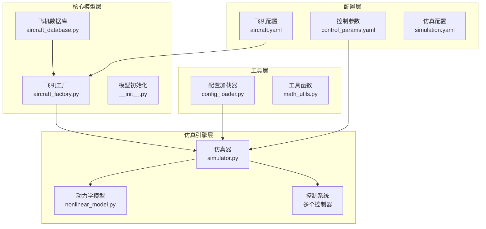
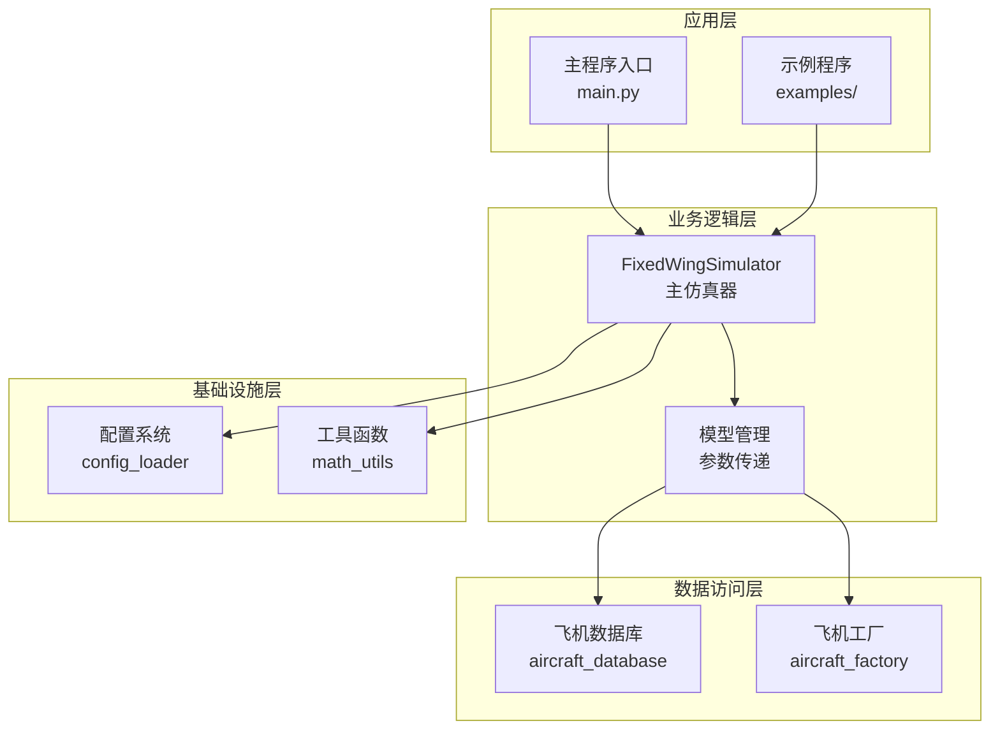
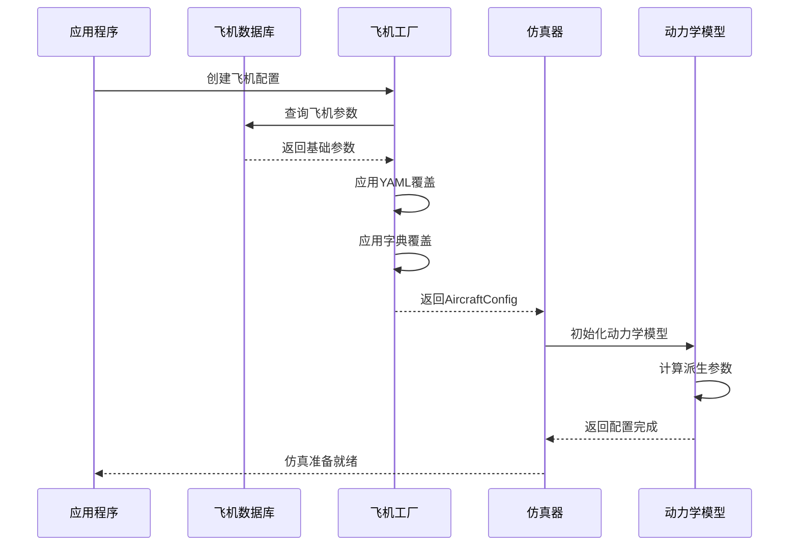
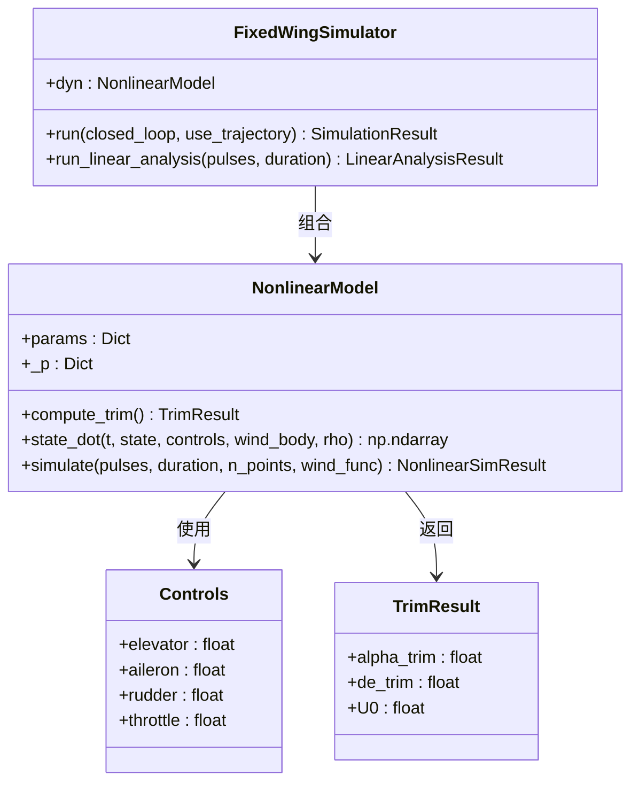
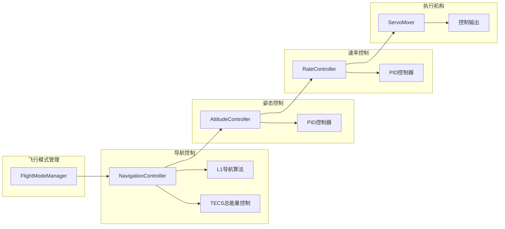
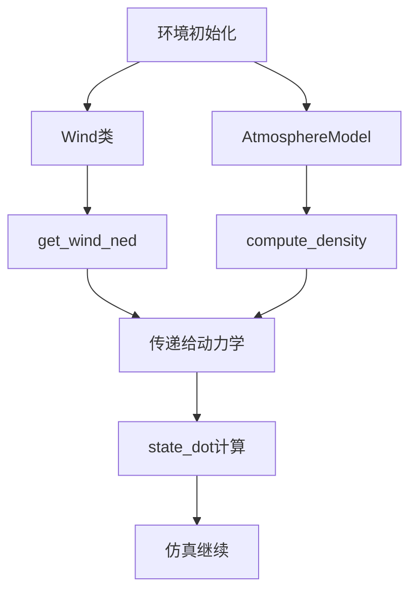
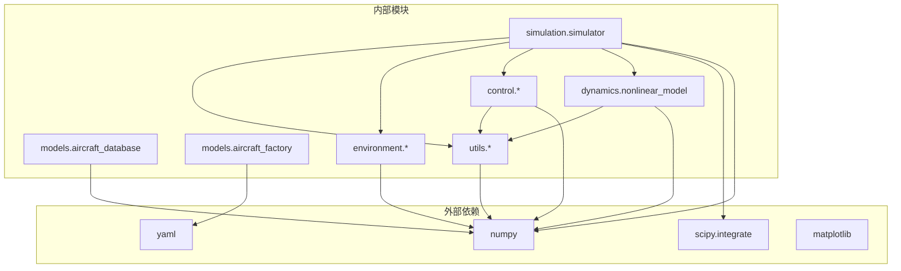
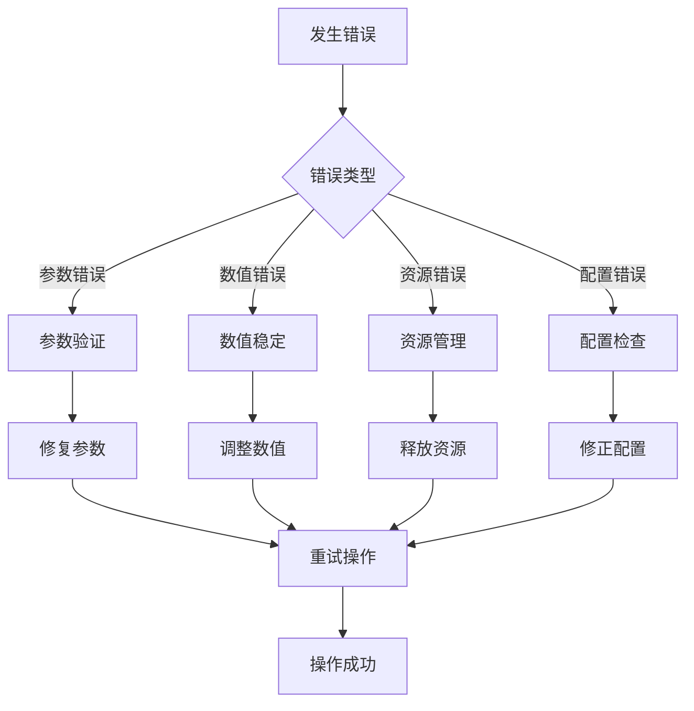

# 飞机模型集成

<cite>
**本文档引用的文件**
- [aircraft_database.py](file://src/models/aircraft_database.py)
- [aircraft_factory.py](file://src/models/aircraft_factory.py)
- [__init__.py](file://src/models/__init__.py)
- [config_loader.py](file://src/utils/config_loader.py)
- [simulator.py](file://src/simulation/simulator.py)
- [nonlinear_model.py](file://src/dynamics/nonlinear_model.py)
- [aerodynamics.py](file://src/dynamics/aerodynamics.py)
- [attitude_controller.py](file://src/control/attitude_controller.py)
- [ardupilot_compat.py](file://src/control/ardupilot_compat.py)
- [aircraft.yaml](file://config/aircraft.yaml)
- [control_params.yaml](file://config/control_params.yaml)
- [simulation.yaml](file://config/simulation.yaml)
- [main.py](file://main.py)
- [example_1_linear_response.py](file://examples/example_1_linear_response.py)
</cite>

## 目录
1. [简介](#简介)
2. [项目结构](#项目结构)
3. [核心组件](#核心组件)
4. [架构概览](#架构概览)
5. [详细组件分析](#详细组件分析)
6. [依赖关系分析](#依赖关系分析)
7. [性能考虑](#性能考虑)
8. [故障排除指南](#故障排除指南)
9. [结论](#结论)
10. [附录](#附录)

## 简介

本文件档详细阐述了固定翼无人机模拟器中飞机模型系统的集成架构。该系统采用数据库-工厂模式协作，实现了从数据库查询到工厂实例化的完整飞机参数传递流程。系统集成了动力学引擎、控制系统、环境模型等多个模块，为仿真提供了完整的解决方案。

该系统的核心创新在于：
- 数据库-工厂模式的完美结合，确保参数的一致性和可扩展性
- 与ArduPilot控制系统的完全兼容性
- 支持线性和非线性动力学模型的统一框架
- 完善的配置管理和参数验证机制

## 项目结构

项目采用模块化设计，按照功能域进行组织：



**图表来源**
- [aircraft_database.py](file://src/models/aircraft_database.py#L1-L183)
- [aircraft_factory.py](file://src/models/aircraft_factory.py#L1-L136)
- [simulator.py](file://src/simulation/simulator.py#L1-L642)

**章节来源**
- [aircraft_database.py](file://src/models/aircraft_database.py#L1-L183)
- [aircraft_factory.py](file://src/models/aircraft_factory.py#L1-L136)
- [__init__.py](file://src/models/__init__.py#L1-L15)

## 核心组件

### 飞机数据库系统

飞机数据库是整个系统的核心数据源，提供了标准化的飞机参数存储和访问接口。

**主要特性：**
- 标准化的参数命名规范，完全兼容原始项目格式
- 内置物理常数和大气模型参数
- 自动派生参数计算（动态压力、密度等）
- 完整的飞机参数列表管理

**支持的飞机类型：**
- TB2（土耳其Baykar公司）
- Anka（土耳其TUSAŞ公司）
- Aksungur（土耳其TUSAŞ公司）
- Karayel（土耳其Vestel公司）
- Predator（美国General Atomics公司）
- Heron MK1（以色列IAI公司）
- Heron MK2（以色列IAI公司）

**章节来源**
- [aircraft_database.py](file://src/models/aircraft_database.py#L29-L133)

### 飞机工厂系统

飞机工厂采用工厂模式设计，负责从数据库加载参数并进行必要的合并和验证。

**核心功能：**
- 参数继承和覆盖机制
- YAML配置文件支持
- ArduPilot参数导出功能
- 配置对象封装

**工厂模式优势：**
- 解耦参数来源和使用方式
- 支持多种参数覆盖策略
- 提供统一的配置接口
- 支持ArduPilot兼容性

**章节来源**
- [aircraft_factory.py](file://src/models/aircraft_factory.py#L39-L136)

### 配置管理系统

配置管理系统提供了统一的配置加载和合并机制。

**配置层次：**
- 默认配置（内置基础参数）
- 文件配置（用户自定义）
- 运行时覆盖（程序参数）

**支持的配置文件：**
- 飞机配置：选择飞机型号和参数覆盖
- 控制参数：ArduPilot兼容的控制参数
- 仿真配置：仿真引擎运行参数

**章节来源**
- [config_loader.py](file://src/utils/config_loader.py#L59-L82)
- [aircraft.yaml](file://config/aircraft.yaml#L1-L13)
- [control_params.yaml](file://config/control_params.yaml#L1-L45)
- [simulation.yaml](file://config/simulation.yaml#L1-L30)

## 架构概览

系统采用分层架构设计，各层职责明确，耦合度低，扩展性强。



**图表来源**
- [main.py](file://main.py#L1-L145)
- [simulator.py](file://src/simulation/simulator.py#L115-L128)
- [aircraft_database.py](file://src/models/aircraft_database.py#L143-L166)
- [aircraft_factory.py](file://src/models/aircraft_factory.py#L42-L74)

## 详细组件分析

### 飞机参数传递流程

飞机参数从数据库到工厂再到仿真引擎的完整传递流程如下：



**图表来源**
- [aircraft_factory.py](file://src/models/aircraft_factory.py#L42-L74)
- [aircraft_database.py](file://src/models/aircraft_database.py#L143-L166)
- [simulator.py](file://src/simulation/simulator.py#L155-L157)

**章节来源**
- [aircraft_factory.py](file://src/models/aircraft_factory.py#L42-L74)
- [aircraft_database.py](file://src/models/aircraft_database.py#L143-L166)

### 动力学系统集成

动力学系统采用6自由度非线性模型，与控制系统紧密集成。



**图表来源**
- [nonlinear_model.py](file://src/dynamics/nonlinear_model.py#L104-L155)
- [simulator.py](file://src/simulation/simulator.py#L239-L269)

**章节来源**
- [nonlinear_model.py](file://src/dynamics/nonlinear_model.py#L104-L155)
- [simulator.py](file://src/simulation/simulator.py#L239-L269)

### 控制系统集成

控制系统采用ArduPilot兼容的五层控制架构：



**图表来源**
- [simulator.py](file://src/simulation/simulator.py#L173-L217)
- [attitude_controller.py](file://src/control/attitude_controller.py#L33-L134)

**章节来源**
- [simulator.py](file://src/simulation/simulator.py#L173-L217)
- [attitude_controller.py](file://src/control/attitude_controller.py#L33-L134)

### 环境模型集成

环境模型提供风场和大气条件的模拟：



**图表来源**
- [simulator.py](file://src/simulation/simulator.py#L159-L163)
- [nonlinear_model.py](file://src/dynamics/nonlinear_model.py#L160-L177)

**章节来源**
- [simulator.py](file://src/simulation/simulator.py#L159-L163)
- [nonlinear_model.py](file://src/dynamics/nonlinear_model.py#L160-L177)

## 依赖关系分析

系统采用松耦合设计，通过清晰的接口实现模块间的通信。



**图表来源**
- [simulator.py](file://src/simulation/simulator.py#L22-L52)
- [nonlinear_model.py](file://src/dynamics/nonlinear_model.py#L22-L28)

**章节来源**
- [simulator.py](file://src/simulation/simulator.py#L22-L52)
- [nonlinear_model.py](file://src/dynamics/nonlinear_model.py#L22-L28)

## 性能考虑

### 数值稳定性

系统在数值计算方面采用了多项优化措施：

- **积分器选择**：根据应用场景选择合适的数值积分器
- **参数范围检查**：对关键参数进行范围验证
- **数值精度控制**：合理设置相对和绝对容差
- **内存管理**：优化状态向量的内存布局

### 并行处理

系统支持多线程和并行计算：

- **批量分析**：支持同时运行多个仿真案例
- **实时仿真**：优化单次仿真的执行效率
- **数据处理**：高效的轨迹数据处理和存储

### 资源管理

- **内存池**：复用临时数组和中间结果
- **缓存机制**：缓存计算结果避免重复计算
- **垃圾回收**：合理管理Python对象生命周期

## 故障排除指南

### 常见问题及解决方案

**飞机参数错误**
- 检查飞机名称是否在支持列表中
- 验证参数覆盖的键名正确性
- 确认参数值在合理范围内

**仿真不稳定**
- 检查初始条件设置
- 调整积分器参数
- 验证控制参数配置

**内存不足**
- 减少仿真持续时间
- 降低采样频率
- 清理不必要的中间结果

### 错误处理策略

系统采用多层次的错误处理机制：



**章节来源**
- [aircraft_database.py](file://src/models/aircraft_database.py#L149-L156)
- [simulator.py](file://src/simulation/simulator.py#L558-L562)

## 结论

该飞机模型系统集成了数据库-工厂模式的最佳实践，实现了从参数查询到仿真执行的完整流水线。系统的主要优势包括：

1. **架构清晰**：分层设计使得系统易于理解和维护
2. **扩展性强**：模块化设计支持新功能的快速添加
3. **兼容性好**：完全兼容ArduPilot控制参数
4. **性能优异**：优化的数值计算和内存管理
5. **可靠性高**：完善的错误处理和参数验证机制

该系统为固定翼无人机仿真提供了一个强大而灵活的平台，既适合学术研究，也适合工程应用。

## 附录

### 使用示例

系统提供了丰富的使用示例，涵盖了不同的应用场景：

**基本使用**
```bash
# 运行默认TB2仿真
python main.py

# 使用不同飞机和模式
python main.py --aircraft Predator --mode FBW_B --duration 60

# 运行线性分析
python main.py --aircraft TB2 --analysis 4dof
```

**编程接口**
```python
from simulation.simulator import FixedWingSimulator

# 创建仿真器
sim = FixedWingSimulator(
    aircraft_name="TB2",
    dt=0.01,
    duration=30.0,
    initial_mode="AUTO"
)

# 添加航路点
sim.wp_mgr.add_waypoint(0.0, 0.0, 0.0)
sim.wp_mgr.add_waypoint(1000.0, 0.0, 0.0)

# 运行仿真
result = sim.run(closed_loop=True)
```

### 配置选项详解

**飞机配置选项**
- `aircraft_name`: 选择飞机型号
- `overrides`: 参数覆盖字典

**控制参数选项**
- `PTCH_P`, `ROLL_P`: 外环比例增益
- `PTCH_RATE_P`, `ROLL_RATE_P`: 内环比例增益
- `LIM_PITCH_MAX`, `LIM_ROLL_CD`: 限制参数

**仿真配置选项**
- `dt`: 时间步长
- `duration`: 仿真持续时间
- `wind_type`: 风场类型
- `integrator`: 数值积分器

### 最佳实践建议

1. **参数管理**：使用YAML文件管理参数，便于版本控制
2. **配置验证**：在运行前验证所有配置参数的有效性
3. **性能监控**：定期监控仿真性能，及时发现瓶颈
4. **错误记录**：建立完善的错误日志系统
5. **测试覆盖**：编写全面的单元测试和集成测试